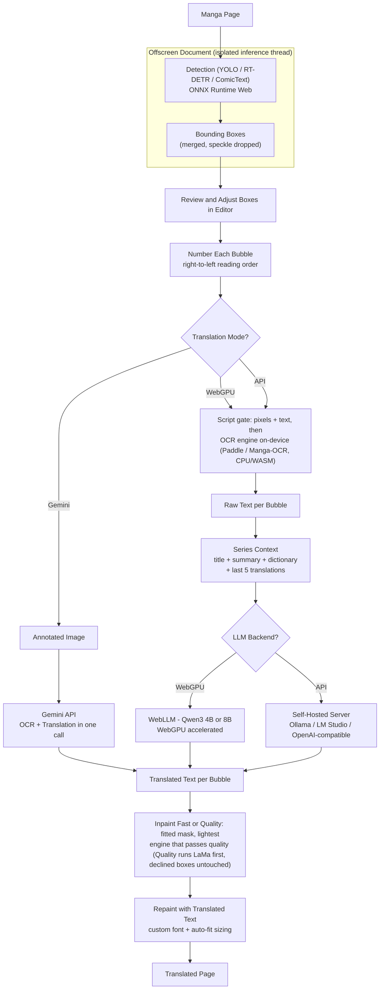

<div align="center">
  
  <h1>Libre Manga Translator</h1>
  <p><i>"Translate manga directly in your browser: 100% on-device (WebGPU), cloud (Gemini), or self-hosted LLM backends"</i></p>

  <p>
    
    
    
    
    
  </p>
</div>

Translate manga in your browser with freedom to choose how. Run everything on your device, offload to the cloud, or point at your own self-hosted LLM backend - you decide where your data goes.

> **Built upon [ComicTL](https://github.com/kiuyha/ComicTL)** by Ketut Shridhara, with the original three-way routing concept inspired by the experimental [Local Manga Translator](https://github.com/mrdhnto/local-manga-translator) proof-of-concept. Actively maintained and evolved by the **LMT Maintainer** with API Mode, an on-device script verification gate, an auto inpainting engine ladder, interactive OCR & translation editing, floating on-page config, and reader compatibility hardening.

---

## Three Translation Modes, One Pipeline

**WebGPU Mode** (default, fully local) runs everything on-device. Qwen3 translates via WebLLM **with WebGPU (GPU) acceleration**; YOLO26 bubble detection and PaddleOCR text extraction run locally on the CPU (WASM). No API key, no account, no uploads. Works completely offline after the initial model download.

**Gemini Mode** (cloud, opt-in) sends the annotated image to Google's Gemini API, which handles both OCR and translation in one call. Your API key goes straight from your browser to Google - no proxy, no middleman.

**API Mode** (self-hosted) connects to your own LLM server (Ollama, LM Studio, or any OpenAI-compatible endpoint) running locally or remotely. Uses local PaddleOCR for text extraction, then sends only the extracted text to your server for translation - no image leaves your machine in this mode. Full control over the model and infrastructure.

*Libre - you choose where your data goes. Toggle back to the original image any time.*

---

## Showcase & Visual Proof

<details open>
<summary>📸 <b>Translation Proof: Raw vs Translated</b></summary>

| Original Raw Manga Page | Translated Result (Inpainted + Rendered) |
| :---: | :---: |
|  |  |

</details>

<details>
<summary>✏️ <b>Interactive Editor & OCR Surfacing</b></summary>

| Bounding Box Refinement | In-Place Translation & OCR Edit Modal |
| :---: | :---: |
|  |  |

</details>

<details>
<summary>⚙️ <b>On-Page Sidebar & Settings Panel</b></summary>

| Floating Sidebar (Pipeline & Backend) | Inpainting & Appearance Settings |
| :---: | :---: |
|  |  |

| Setup Wizard (Onboarding) | Debugging & Latency Logs |
| :---: | :---: |
|  |  |

</details>

---

## How It Works



Detection never sends an image anywhere. The detection models run in a dedicated offscreen document, keeping inference off the main page thread and away from the popup UI. See [docs/technical.md](docs/technical.md) for the full model list.

---

## Features

**Full local pipeline.** YOLO26-Nano runs via ONNX Runtime Web by default (Small, RT-DETR bubble detector, and Comic Text Detector with pixel-mask seeding are selectable in Settings › Detection). PaddleOCR extracts text on-device. Qwen3 4B or 8B translates via WebLLM with WebGPU acceleration. After the first model download, the whole pipeline works offline.

**Cloud option.** Point LMT at any Gemini model you have access to. The annotated image goes directly from your browser to the Gemini API. Good for when you want higher accuracy or your machine does not have a GPU.

**Bubble editor.** Detected boxes are numbered in manga reading order (right to left, top to bottom). Drag, resize, add, delete, undo, redo before you commit to translating.

**Series context.** Set a title, plot summary, and custom glossary per series. The last five translations get included automatically so character names and terminology stay consistent across chapters.

**Site adapters.** LMT matches the current URL against a list of community-written regex rules to extract the series name, chapter ID, and page index. If your site is not covered, the extension can generate a rule for it using whichever AI you have active. You can also write one manually in about three minutes and submit a PR.

**Custom fonts.** Three fonts ship with the extension (Noto Sans, Bangers, Comic Neue). Drop any TTF, OTF, or WOFF file into the Settings tab to use your own.

**Opt-in improvement data.** When you correct a bounding box, LMT can send the adjusted coordinates and the original image url / site url to help retrain the detection model. This is opt-in during onboarding and can be turned off at any time.

**API Mode for self-hosted backends.** Connect to your own LLM server running locally or on your network. Supports:
- **OpenAI-compatible APIs** (Ollama, OpenRouter, Venice AI, and others)
- **LM Studio experimental endpoint** with native prompt format and structured output
- Any endpoint at `/v1/chat/completions`

**Dual schema support.** Switch between standard OpenAI (`response_format.json_object`) and LM Studio experimental (`input` array + `system_prompt`) payload formats without changing your model.

**Editable translations & OCR inspection.** In the results view, open the **Edit** modal to inspect raw OCR text side-by-side with translated text per bubble. Tweak translations manually and click **Apply** to re-render directly on the canvas without re-running inpainting.

**Image export.** Save and download full-resolution translated pages directly as JPEG via the results toolbar.

**Toggle to compare.** Toggle to swap the image between original and translated result.

**On-page sidebar panel.** A floating cog opens a sliding settings panel directly on the page (no need to open the popup). It shares the same settings components as the popup, so both stay in sync.

**Fast inpainting (engine ladder, default).** The default clean path fits a text-shaped mask per region and uses the lightest engine that does the job: a planar fill that samples the paper around the text on flat pages, a bilateral denoise fill on grainy/JPEG scans, and Telea fast-marching only where the region needs a real rebuild. Every result is scored by one quality check - if it looks worse than the paper around it, the region climbs to the next engine, and if nothing passes it is left exactly as it was and flagged for you. Untouched pixels stay identical; no ghost rectangles, no flat patches, no halos. No downloads, no extra memory.

**Quality inpainting (LaMa redraw).** For complex screentone, halftone, and art behind text, **Quality** runs the LaMa redraw model first per region and automatically falls back into Fast wherever LaMa declines - so it is a strict superset of Fast. One-time ~207 MB download, ~500 MB RAM/VRAM, ~30–60s per complex region on CPU. Switch between **Fast** and **Quality** under **Appearance › Inpainting**.

**Language gate.** Before translating, LMT checks each detected region really holds the source language - a lightweight on-device script-identification model (a ~3.7 MB download) over the actual pixels, confirmed against the recognized text. Sound effects, lettering over artwork, and a localiser's Latin text on a Japanese page are held back instead of machine-translated into garbage: they keep their original text and are marked with a dashed outline and a **Translate anyway** button, so a wrong call is always one click from being undone. Strict when you pick a source language (especially Japanese/Chinese/Korean), gentle under **Auto-Detect** where it follows the page's majority script. Toggle in **Settings › OCR**.

**OCR engine choice.** Pick the text reader in **Settings › OCR**: PaddleOCR (~90 MB, fast multilingual default — Latin + Chinese/Japanese packs ship at setup, 9 more language packs download on first use and the script gate auto-switches packs per page) or Manga-OCR (~460 MB, Japanese manga specialist that handles vertical text and stylized lettering). If the needed pack isn't cached yet, the overlay says which model it's downloading instead of spinning silently. Held-back regions keep their recognized text so you can still view and edit it.

**Model storage.** **Settings › Model Storage** lists every downloaded weight with its size and language-group badge (e.g. `latin`, `chinese` for PaddleOCR packs), plus per-model delete and full cache clear. Translation results are keyed per page + image, so re-opening a page reuses prior work.

**Universal cross-origin & anti-hotlink support.** Automatic fallback using background declarativeNetRequest to bypass CDN referer checks and Cloudflare protection on third-party manga hosting domains (e.g. `i.sstatic.net`, `imgsrv5.com`, `scans.lastation.us`). Combined with magic-byte MIME sniffing for robust image decoding across all formats (JPEG, PNG, WebP, GIF, AVIF).

**Advanced debugging.** Session logs with JSON export, clipboard copying, and per-request metadata: mode, OCR text, translations, timing per step, bbox count, inpainting method (fast · quality · fallback) + per-rung counts (fill · denoise · lama · telea · declined), language-gate decisions, errors. No base64 or image payloads - lean and readable.

---

## Installation

### From Source (Current Development Version)

Requires [Bun](https://bun.sh).

```bash
git clone https://github.com/mrdhnto/libre-manga-translator.git
cd libre-manga-translator
bun install

# Development with hot reload
bun run dev           # Chrome
bun run dev:firefox   # Firefox

# Production build
bun run build
bun run build:firefox
```

Copy `.env.example` to `.env` and fill in the values before building.

### Chrome

1. Build the project: `bun run build`
2. Open `chrome://extensions`
3. Enable **Developer mode** (toggle in the top right)
4. Click **Load unpacked** and select the `.output/chrome-mv3/` folder

### Firefox

1. Build the project: `bun run build:firefox`
2. Open `about:debugging#/runtime/this-firefox`
3. Click **Load Temporary Add-on**
4. Select any file inside the `.output/firefox-mv3/` folder

> Firefox temporary add-ons do not survive a browser restart. A signed Firefox release is planned for a future version.

### First-time setup

Open the extension popup and go through the onboarding flow, or go to **Settings** directly.

- **WebGPU Mode:** Select WebGPU in the Home tab and let the model weights download once. Roughly 3–6 GB depending on which LLM you pick (Qwen3 4B or 8B).
- **Gemini Mode:** Paste your Gemini API key (free at [aistudio.google.com](https://aistudio.google.com)), then set the mode to Gemini in the Home tab.
- **API Mode:**
  1. Select API Mode in the Home tab
  2. Choose your schema (OpenAI or LM Studio)
  3. Set the Host URL (e.g. `http://127.0.0.1:11434/v1` for Ollama or `http://127.0.0.1:1234/api/v1` for LM Studio)
  4. Enter your model name (e.g. `qwen3.5:4b`)
  5. Click **Test Connection** to verify

---

## Quick Start

1. Open any manga page in Chrome or Firefox
2. Click the LMT icon, or right-click the page and select **Translate Image**
3. The overlay opens and runs bubble detection automatically
4. Adjust any boxes that were missed or drawn wrong
5. Click **Confirm**
6. Read, or use the results toolbar:
   - **Edit:** Adjust translations or fix typos with live canvas re-render
   - **Refine Boxes:** Go back to adjust bubble coordinates and re-translate
   - **Save JPG:** Export full-resolution translated image
   - **Original toggle:** Swap between raw page and translated result

---

## API Mode Setup Guide

### Recommended: Ollama

1. **Install Ollama:** Download from [ollama.com](https://ollama.com)
2. **Pull a model:** `ollama pull qwen3.5:4b`
3. **Configure LMT:**
   - Host: `http://127.0.0.1:11434/v1`
   - Schema: OpenAI
   - Model: `qwen3.5:4b`

### Alternative: LM Studio

1. **Download LM Studio:** Install from [lmstudio.ai](https://lmstudio.ai)
2. **Download a model:** Search for and download a text model like `tiny-aya-global`
3. **Start Local Server:**
   - Go to the **Local Server** tab
   - Select your model
   - Click **Start Server**
4. **Configure LMT:**
   - Host: `http://127.0.0.1:1234/api/v1`
   - Schema: LM Studio (Experimental)
   - Model: match what you loaded in LM Studio

### OpenAI-Compatible Services

Any service exposing `/v1/chat/completions` works:
- **OpenRouter:** `https://openrouter.ai/api/v1`
- **Venice AI:** `https://api.venice.ai/api/v1`
- **Together AI:** `https://api.together.xyz/v1`

---

## Adding Site Support (Pull Requests Welcome)

LMT figures out the series name, chapter ID, and page index for each URL using site adapter rules. Most manga sites are not covered yet.

Adding one is the shortest contribution you can make to this project, and it helps everyone who reads on that site.

### Where rules live

There are two places, with clear separation:

- **`src/lib/adapters/`** - community adapters. One file per site, auto-imported at build time. This is where your PR goes. No registry edits, no build config - drop a file in and the next build bundles it.
- **`src/lib/adapters.ts`** - trusted core, maintained by the LMT maintainers for long-trusted, stable sites. If your adapter becomes a community staple, it may graduate here.

Precedence on domain conflicts: user custom rules > trusted core > community adapters.

### What an adapter looks like

```typescript
// src/lib/adapters/mangadex.ts

// One file per site. Auto-imported at build time.
// See src/lib/adapters/README.md and _example.ts.
export default {
  id: "mangadex",
  domain: "mangadex.org",
    seriesName: {
      regex: "^(?:.*?\\|\\s*)?(?:(?:Chapter|Vol)[^\\-]+\\-\\s*)?(.*?)\\s*\\-\\s*MangaDex",
      source: "title",     // extract from document.title
    },
    chapterId: {
      regex: "\\/chapter\\/([^/]+)",
      source: "path",      // extract from window.location.pathname
    },
    pageIndex: {
      regex: "\\/(\\d+)\\/?$",
      source: "path",
    },
  },
} satisfies SiteRule;
```

Each field needs a `regex` with exactly one capturing group and a `source` (`"title"` for `document.title`, `"path"` for `window.location.pathname`).

### You do not need to write the regex by hand

Open any chapter on the site you want to support, click the LMT icon, and use the **AI rule generator** in Settings. It reads the current page title and URL, sends them to whichever AI you have active (WebGPU, Gemini, or API), and returns a draft rule you can paste straight into your adapter file.

The one rule: the regex has to work for any manga on that site, not just the one you tested on. Verify it against at least two different series before submitting.

### Submitting

1. Fork the repo
2. Copy `src/lib/adapters/_example.ts` to `src/lib/adapters/<site-domain>.ts` and fill it in
3. Open a PR with the site name in the title

That is it. The next build picks the file up automatically - no registry to edit.

---

## Detection Models

Four selectable detectors, all on-device: YOLO26-Nano (default, 2.4 MB, bubbles fast), YOLO26-Small (9.5 MB, denser bubbles), Comic Bubble Detector RT-DETR (11.1 MB, bubbles + free text), and Comic Text Detector with pixel-mask seeding (94.7 MB, denser bubbles + free text). Switch in **Settings › Detection** (Min Confidence 0.5, Auto-Update on).

Full table with accuracy metrics, licenses, and weight links: [docs/technical.md](docs/technical.md).

---

## Tech Stack

WXT + Svelte 5 + TypeScript + Tailwind CSS. On-device detection (YOLO26 / RT-DETR / ComicTextDetector), OCR (PaddleOCR / Manga-OCR), and Fast inpaint ladder (planar fill / denoise / Telea) or Quality LaMa-first pass via ONNX Runtime Web; WebLLM Qwen3, Gemini, or self-hosted LLM for translation. Bun for builds.

Full layer table: [docs/technical.md](docs/technical.md).

---

## Project Structure

Standard WXT layout: `src/entrypoints/` (background, content, offscreen, popup, setup) + `src/lib/` (detections, OCR, gate, inpaint, gemini, server, adapters, components) + `scripts/` self-checks.

Full annotated tree: [docs/technical.md](docs/technical.md).

---

## Roadmap & Status

LMT is under active development. Releases are intentionally infrequent while
the pipeline stabilizes - this section reflects what's actually being worked
on right now, not just a wishlist. Check the [commit history](../../commits/development)
for day-to-day activity between releases.

### ✅ Released

- *Mouse event handling in the bubble editor* - fix drag/resize interactions had takeover the event when LMT showed the overlay.
- *Fast inpainting engine ladder* (shipped as Auto, renamed in the Beta5 RC) - fitted text-shaped masks and the lightest engine that passes a quality check; removes the ghost-rectangle, flat-patch, and halo artifacts of the old single-mask Telea path.
- *Language gate* - on-device script verification that stops sound effects, artwork lettering, and wrong-language text from being machine-translated into garbage; every hold-back is one-click overridable.
- *Deterministic region build* - merged fragments, dropped speckle, reading-order stability after detection.
- *Manga-OCR engine* - selectable Japanese specialist (~460 MB) that fixes vertical text and stylized lettering PaddleOCR dropped or misread. Pick it in **Settings › OCR**.
- *Quality inpainting (LaMa-first)* - deep-learning redraw for screentone/halftone/art behind text (~207 MB one-time download, ~30–60s per region on CPU), with automatic Fast fallback per region. Pick **Fast** or **Quality** under **Appearance › Inpainting**.
- *Extra detectors + model storage* - RT-DETR bubble detector and Comic Text Detector with pixel-mask seeding in **Settings › Detection**; **Settings › Model Storage** lists, deletes, and clears cached weights.
- *Per-language PaddleOCR packs* - 11 recognition packs (latin, chinese, korean, thai, arabic, hindi, …) resolved per page by the script gate under Auto-Detect or by your source language; Latin + Chinese/Japanese download during onboarding so the common switch needs no mid-translate fetch. Korean, Thai, and other packs fetch on first encounter, with an overlay download notice while they do.
- *Region tracking & OCR hardening* - page-index + image-hash cache keys, contrast/pad preprocessing, lower default Min Confidence (0.7), gate-held boxes keep their text for viewing/editing.

### 🔧 In Progress

- *Inpainting hardening* - Combine LaMa with golden-image verification of each inpaint rung and gate edge cases; screentone fixtures for the escalation path.
- *Chinese & Korean OCR (manhua / manhwa / webtoon)* - Japanese and vertical text are covered by Manga-OCR; CJK coverage beyond Japanese is the current OCR target.

### 🐛 Known Issues (actively investigating)

- *OCR reliability on Manhua / Manhwa / Webtoon text* - text extraction
  intermittently fails on Chinese/Korean formats. Per-language packs now ship/fetch automatically; remaining work is recognition quality on these layouts.
- *Gate false negatives* - heavily stylized or mixed-script lettering can still be read
  as the wrong script; the language gate marks every hold-back and offers **Translate
  anyway**, so it never silently drops a bubble.

Found a bug not listed here? Open an issue - it helps prioritize.

### 🗺️ Planned

- Signed Firefox release
- Signed Chrome release
- Auto Translate
- More community site adapters

---

*Status as of September 2026. This list changes as issues are found and fixed
during dev testing - it's not a fixed commitment, just where things stand.*

---

## Contributing

This is a community-driven project. Whether you are a developer or a manga reader with a great idea, contributions are welcome.

- Found a bug? Open an issue.
- Have a feature idea? Start a discussion.
- Want to code? Submit a Pull Request.

The easiest place to start is a **site adapter PR** - add support for your favorite manga site in about three minutes.

---

## Credits & Attribution

This project is built upon **[ComicTL](https://github.com/kiuyha/ComicTL)** by Ketut Shridhara, which provided:
- YOLO26 bubble detection pipeline and ONNX Runtime Web integration
- PaddleOCR on-device text extraction with coordinate mapping
- WebLLM translation foundation (Qwen3 via WebGPU)
- Interactive bubble editor with undo/redo and reading-order sort
- Series context and custom glossary system
- Site adapter framework with AI rule generation
- Gemini cloud translation path

Enhanced with **API Mode** and additional features inspired by the experimental **[Local Manga Translator](https://github.com/mrdhnto/local-manga-translator)** proof-of-concept (the origin of the LMT acronym), contributing:
- Self-hosted LLM server support (Ollama, LM Studio, OpenAI-compatible)
- Dual schema architecture (OpenAI standard + LM Studio experimental)
- `testServerConnection()` model probe and retry logic
- Advanced debugging concept and session logging

The **auto inpaint engine ladder** and **language gate** techniques were inspired by
architectural concepts studied in **[Manga Cleaner](https://github.com/k-omiq/manga-cleaner)**
(GPL-3.0) by KoMiQ. LMT's implementation is an independent TypeScript rewrite designed
for browser constraints (MV3 CSP, offscreen document, limited memory); no source code
was copied. Algorithm thresholds and parameters were re-derived through testing against
LMT's environment.

**Techniques adapted:**
- Fitted text-shaped masks vs. full-region inpainting
- Multi-stage engine ladder with quality-gated escalation
- Script verification gate to prevent mistranslation of non-target text
- Bilateral denoise for grainy scans

### Key Components

Detection (YOLO26, RT-DETR, ComicTextDetector), script gate (OSD LSTM), OCR (PaddleOCR, Manga-OCR), inpainting (auto ladder + optional LaMa), local translation (WebLLM Qwen3 4B / 8B). Built on WXT + Svelte 5 + TypeScript + Tailwind CSS.

Full per-model table with sizes, licenses, and weight links: [docs/technical.md](docs/technical.md).

---

## License

[MIT](LICENSE)

This project is a derivative work. Copyright notices apply as follows:

- **ComicTL codebase** - Copyright (c) 2025 Ketut Shridhara ([ComicTL](https://github.com/kiuyha/ComicTL))
- **LMT additions** (API Mode, three-way routing, server schemas, prompt unification, runtime hardening, and all subsequent phases) - Copyright (c) 2025 Riski Mardhianto ([mrdhnto](https://github.com/Mrdhnto))

Both portions are released under the MIT License. See [LICENSE](LICENSE) for full terms.

**Optional Third-Party Model Weights:**
- `comictextdetector.pt.onnx` is licensed under **GPL-3.0** by dmMaze and manga-image-translator. It is not bundled in the extension repository or release packages. When selected by the user in settings, the weights are downloaded directly on-demand to the user's local browser cache from the upstream public release. LMT's client wrapper is a clean-room independent TypeScript rewrite under the MIT License.

---

## Disclaimer

This project is for personal use and educational exploration of flexible AI deployment in browser extensions. Always support the official releases of the manga you read.
