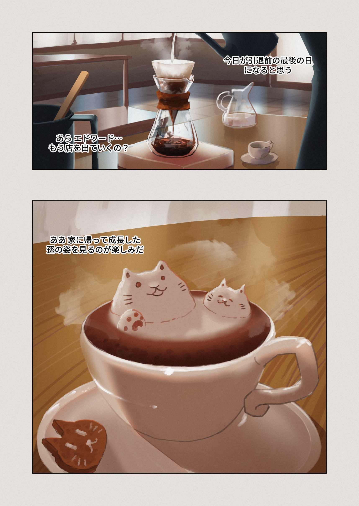
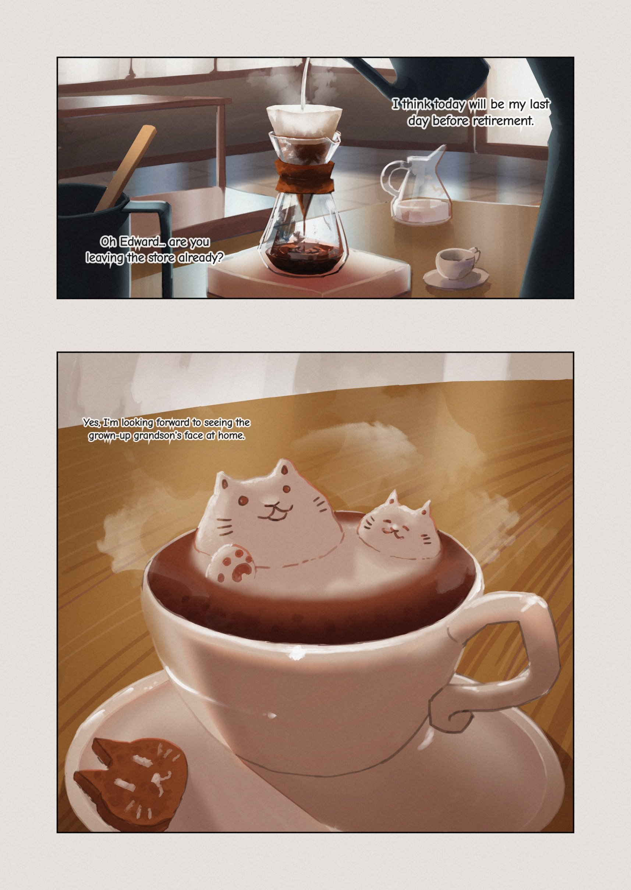
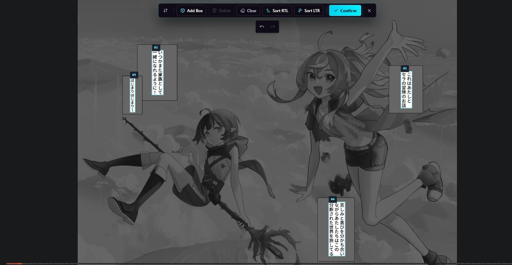
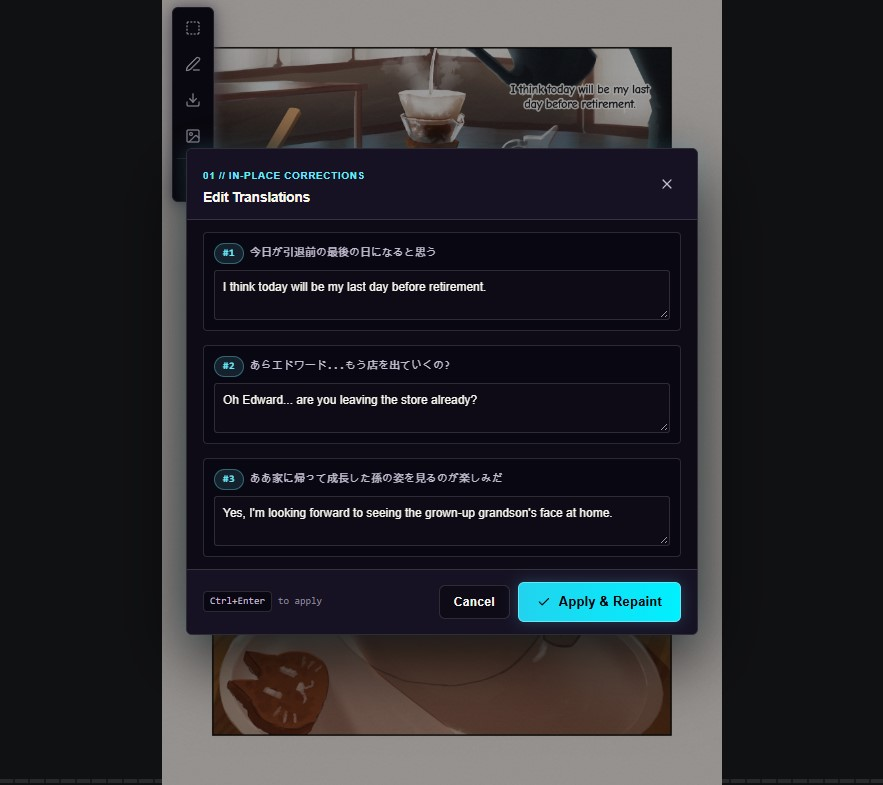
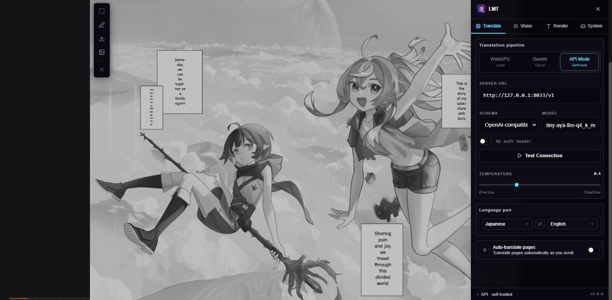
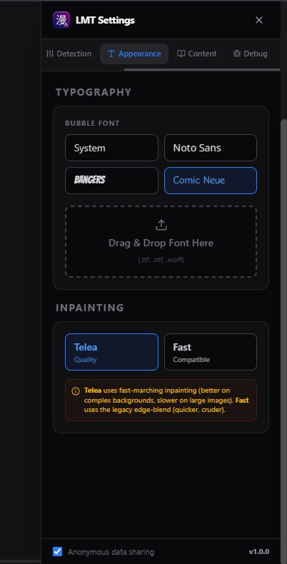
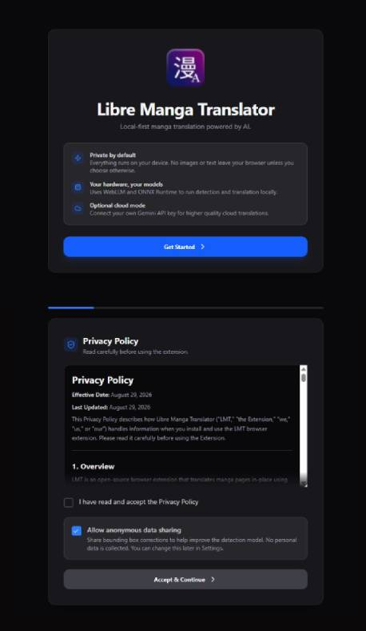
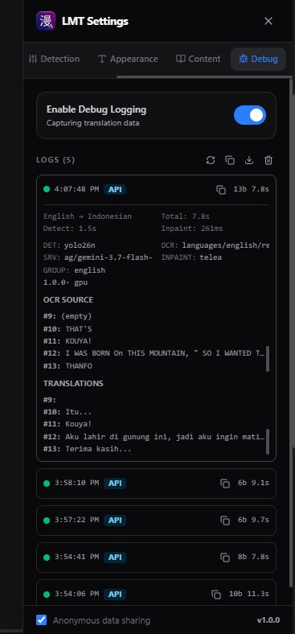
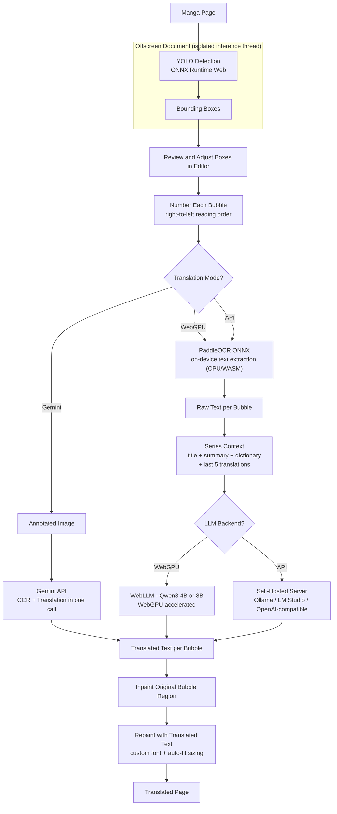

<div align="center">
  
  <h1>Libre Manga Translator</h1>
  <p><i>"Translate manga directly in your browser: 100% on-device (WebGPU), cloud (Gemini), or self-hosted LLM backends"</i></p>

  <p>
    
    
    
    
    
  </p>
</div>

Translate manga in your browser with freedom to choose how. Run everything on your device, offload to the cloud, or point at your own self-hosted LLM backend - you decide where your data goes.

> **Build on [ComicTL](https://github.com/kiuyha/ComicTL)** by Ketut Shridhara, with the original three-way mode concept inspired by the experimental [Local Manga Translator](https://github.com/mrdhnto/local-manga-translator) proof-of-concept. Further enhanced by the **LMT Maintainer** with API Mode, self-hosted backends, OCR surfacing, editable translations, better on-page sidebar config, better debug module and the pure-JS Telea inpainting engine.

---

## Three Translation Modes, One Pipeline

**WebGPU Mode** (default, fully local) runs everything on-device. Qwen3 translates via WebLLM **with WebGPU (GPU) acceleration**; YOLO26 bubble detection and PaddleOCR text extraction run locally on the CPU (WASM). No API key, no account, no uploads. Works completely offline after the initial model download.

**Gemini Mode** (cloud, opt-in) sends the annotated image to Google's Gemini API, which handles both OCR and translation in one call. Your API key goes straight from your browser to Google - no proxy, no middleman.

**API Mode** (self-hosted) connects to your own LLM server (Ollama, LM Studio, or any OpenAI-compatible endpoint) running locally or remotely. Uses local PaddleOCR for text extraction, then sends only the extracted text to your server for translation - no image leaves your machine in this mode. Full control over the model and infrastructure.

*Libre - you choose where your data goes. Toggle back to the original image any time.*

---

## Showcase & Visual Proof

<details open>
<summary>📸 <b>Translation Proof: Raw vs Translated</b></summary>

| Original Raw Manga Page | Translated Result (Inpainted + Rendered) |
| :---: | :---: |
|  |  |

</details>

<details>
<summary>✏️ <b>Interactive Editor & OCR Surfacing</b></summary>

| Bounding Box Refinement | In-Place Translation & OCR Edit Modal |
| :---: | :---: |
|  |  |

</details>

<details>
<summary>⚙️ <b>On-Page Sidebar & Settings Panel</b></summary>

| Floating Sidebar (Pipeline & Backend) | Inpainting & Appearance Settings |
| :---: | :---: |
|  |  |

| Setup Wizard (Onboarding) | Debugging & Latency Logs |
| :---: | :---: |
|  |  |

</details>

---

## How It Works



Detection never sends an image anywhere. The YOLO model runs in a dedicated offscreen document, keeping inference off the main page thread and away from the popup UI.

---

## Features

**Full local pipeline.** YOLO26-Nano runs via ONNX Runtime Web. PaddleOCR extracts text on-device. Qwen3 4B or 8B translates via WebLLM with WebGPU acceleration. After the first model download, the whole pipeline works offline.

**Cloud option.** Point LMT at any Gemini model you have access to. The annotated image goes directly from your browser to the Gemini API. Good for when you want higher accuracy or your machine does not have a GPU.

**Bubble editor.** Detected boxes are numbered in manga reading order (right to left, top to bottom). Drag, resize, add, delete, undo, redo before you commit to translating.

**Series context.** Set a title, plot summary, and custom glossary per series. The last five translations get included automatically so character names and terminology stay consistent across chapters.

**Site adapters.** LMT matches the current URL against a list of community-written regex rules to extract the series name, chapter ID, and page index. If your site is not covered, the extension can generate a rule for it using whichever AI you have active. You can also write one manually in about three minutes and submit a PR.

**Custom fonts.** Three fonts ship with the extension (Noto Sans, Bangers, Comic Neue). Drop any TTF, OTF, or WOFF file into the Settings tab to use your own.

**Opt-in improvement data.** When you correct a bounding box, LMT can send the adjusted coordinates and the original image url / site url to help retrain the detection model. This is opt-in during onboarding and can be turned off at any time.

**API Mode for self-hosted backends.** Connect to your own LLM server running locally or on your network. Supports:
- **OpenAI-compatible APIs** (Ollama, OpenRouter, DeepSeek, and others)
- **LM Studio experimental endpoint** with native prompt format and structured output
- Any endpoint at `/v1/chat/completions`

**Dual schema support.** Switch between standard OpenAI (`response_format.json_object`) and LM Studio experimental (`input` array + `system_prompt`) payload formats without changing your model.

**Editable translations & OCR inspection.** In the results view, open the **Edit** modal to inspect raw OCR text side-by-side with translated text per bubble. Tweak translations manually and click **Apply** to re-render directly on the canvas without re-running inpainting.

**Image export.** Save and download full-resolution translated pages directly as JPEG via the results toolbar.

**Toggle to compare.** Toggle to swap the image between original and translated result.

**On-page sidebar panel.** A floating cog opens a sliding settings panel directly on the page (no need to open the popup). It shares the same settings components as the popup, so both stay in sync.

**Inpaint method toggle.** Choose between **Telea** (pure-JS fast-marching inpainting - better on complex backgrounds, slower on large images) and **Fast** (legacy edge-blend - quicker, cruder). Found under **Appearance** in the sidebar or popup.

**Universal cross-origin & anti-hotlink support.** Automatic fallback using background declarativeNetRequest to bypass CDN referer checks and Cloudflare protection on third-party manga hosting domains (e.g. `i.sstatic.net`, `imgsrv5.com`, `scans.lastation.us`). Combined with magic-byte MIME sniffing for robust image decoding across all formats (JPEG, PNG, WebP, GIF, AVIF).

**Advanced debugging.** Session logs with JSON export, clipboard copying, and per-request metadata: mode, OCR text, translations, timing per step, bbox count, inpainting method, errors. No base64 or image payloads - lean and readable.

---

## Installation

### From Source (Current Development Version)

Requires [Bun](https://bun.sh).

```bash
git clone https://github.com/mrdhnto/local-manga-translator.git
cd local-manga-translator/lmt-1.0.0-alpha
bun install

# Development with hot reload
bun run dev           # Chrome
bun run dev:firefox   # Firefox

# Production build
bun run build
bun run build:firefox
```

Copy `.env.example` to `.env` and fill in the values before building.

### Chrome

1. Build the project: `bun run build`
2. Open `chrome://extensions`
3. Enable **Developer mode** (toggle in the top right)
4. Click **Load unpacked** and select the `.output/chrome-mv3/` folder

### Firefox

1. Build the project: `bun run build:firefox`
2. Open `about:debugging#/runtime/this-firefox`
3. Click **Load Temporary Add-on**
4. Select any file inside the `.output/firefox-mv3/` folder

> Firefox temporary add-ons do not survive a browser restart. A signed Firefox release is planned for a future version.

### First-time setup

Open the extension popup and go through the onboarding flow, or go to **Settings** directly.

- **WebGPU Mode:** Select WebGPU in the Home tab and let the model weights download once. Roughly 3–6 GB depending on which LLM you pick (Qwen3 4B or 8B).
- **Gemini Mode:** Paste your Gemini API key (free at [aistudio.google.com](https://aistudio.google.com)), then set the mode to Gemini in the Home tab.
- **API Mode:**
  1. Select API Mode in the Home tab
  2. Choose your schema (OpenAI or LM Studio)
  3. Set the Host URL (e.g. `http://127.0.0.1:11434/v1` for Ollama or `http://127.0.0.1:1234/api/v1` for LM Studio)
4. Enter your model name (e.g. `qwen2.5:7b`)
   5. Click **Test Connection** to verify

---

## Quick Start

1. Open any manga page in Chrome or Firefox
2. Click the LMT icon, or right-click the page and select **Translate Image**
3. The overlay opens and runs bubble detection automatically
4. Adjust any boxes that were missed or drawn wrong
5. Click **Confirm**
6. Read, or use the results toolbar:
   - **Edit:** Adjust translations or fix typos with live canvas re-render
   - **Refine Boxes:** Go back to adjust bubble coordinates and re-translate
   - **Save JPG:** Export full-resolution translated image
   - **Original toggle:** Swap between raw page and translated result

---

## API Mode Setup Guide

### Recommended: Ollama

1. **Install Ollama:** Download from [ollama.com](https://ollama.com)
2. **Pull a model:** `ollama pull qwen2.5:7b`
3. **Configure LMT:**
   - Host: `http://127.0.0.1:11434/v1`
   - Schema: OpenAI
   - Model: `qwen2.5:7b`

### Alternative: LM Studio

1. **Download LM Studio:** Install from [lmstudio.ai](https://lmstudio.ai)
2. **Download a model:** Search for and download a text model like `qwen2.5-7b-instruct`
3. **Start Local Server:**
   - Go to the **Local Server** tab
   - Select your model
   - Click **Start Server**
4. **Configure LMT:**
   - Host: `http://127.0.0.1:1234/api/v1`
   - Schema: LM Studio (Experimental)
   - Model: match what you loaded in LM Studio

### OpenAI-Compatible Services

Any service exposing `/v1/chat/completions` works:
- **OpenRouter:** `https://openrouter.ai/api/v1`
- **DeepSeek:** `https://api.deepseek.com/v1`
- **Together AI:** `https://api.together.xyz/v1`

---

## Adding Site Support (Pull Requests Welcome)

LMT figures out the series name, chapter ID, and page index for each URL using a small array of regex rules in [`src/lib/adapters.ts`](src/lib/adapters.ts). Most manga sites are not in that list yet.

Adding one is the shortest contribution you can make to this project, and it helps everyone who reads on that site.

### What a rule looks like

```typescript
// src/lib/adapters.ts

// COMMUNITY RULES -- PULL REQUESTS WELCOME!
// To add a new site, add a new object to this array.
export const COMMUNITY_RULES: SiteRule[] = [
  {
    id: "mangadex",
    domain: "mangadex.org",
    seriesName: {
      regex: "^(?:.*?\\|\\s*)?(?:(?:Chapter|Vol)[^\\-]+\\-\\s*)?(.*?)\\s*\\-\\s*MangaDex",
      source: "title",     // extract from document.title
    },
    chapterId: {
      regex: "\\/chapter\\/([^/]+)",
      source: "path",      // extract from window.location.pathname
    },
    pageIndex: {
      regex: "\\/(\\d+)\\/?$",
      source: "path",
    },
  },
  // your rule goes here
];
```

Each rule needs three fields: `seriesName`, `chapterId`, and `pageIndex`. Each field names a source (`"title"` or `"path"`) and a regex with one capturing group.

### You do not need to write the regex by hand

Open any chapter on the site you want to support, click the LMT icon, and use the **AI rule generator** in Settings. It reads the current page title and URL, sends them to whichever AI you have active (WebGPU, Gemini, or API), and returns a draft rule you can paste straight into the array.

The one rule: the regex has to work for any manga on that site, not just the one you tested on.

### Submitting

1. Fork the repo
2. Add your object to `COMMUNITY_RULES` in `src/lib/adapters.ts`
3. Open a PR with the site name in the title

---

## Detection Model

The bubble detector is a custom YOLO26 model trained on 5,595 manga pages from Manga109-s and MangaDex. It runs locally in the offscreen document via ONNX Runtime Web.

| Model | Precision | Recall | mAP@50 | mAP@50-95 | Params |
|---|---|---|---|---|---|
| YOLO26-Nano (default) | 0.929 | 0.863 | 0.947 | 0.765 | 2.4M |
| YOLO26-Small | 0.937 | 0.893 | 0.961 | 0.802 | 9.5M |

Nano is fast enough for interactive use and handles most manga without issues. Small is more accurate on pages with dense or small text but takes roughly 2.5x longer to run.

**Weights:** [Hugging Face - Kiuyha/Manga-Bubble-YOLO](https://huggingface.co/Kiuyha/Manga-Bubble-YOLO)

### Detection settings

| Setting | Default | Notes |
|---|---|---|
| Model | YOLO26-Nano | Switch to Small for dense or small-text pages |
| Min Confidence | 0.5 | Lower catches more bubbles but increases false positives |
| Auto-Update | On | Downloads new weights automatically when available |

---

## Tech Stack

| Layer | Technology |
|---|---|
| Extension framework | [WXT](https://wxt.dev) |
| UI | [Svelte 5](https://svelte.dev) with runes |
| Language | TypeScript |
| Styling | Tailwind CSS |
| Bubble detection | YOLO26 ONNX via ONNX Runtime Web |
| On-device OCR | PaddleOCR ONNX |
| Local translation | [WebLLM](https://webllm.mlc.ai/) (Qwen3 4B / 8B) |
| Cloud translation | Gemini API via REST |
| API Mode backends | Ollama, LM Studio, OpenAI-compatible |
| Storage | WXT storage (wraps chrome.storage) |
| Build | Bun |
| Telemetry | Supabase / Rest API (opt-in bbox coordinates only) |

---

## Project Structure

```
src/
  assets/
    app.css              # Global styles and @font-face declarations
    fonts/               # Bundled fonts (Noto Sans, Bangers, Comic Neue)

  entrypoints/
    background/          # Service worker: message router, context menu, model prefetch
    content/             # Injected into the page: mounts overlay + sidebar, debug logging
    content/debug.ts     # Ring-buffer debug logger (OCR/text/timing only, no images)
    offscreen/           # Isolated document: YOLO, OCR, LLM inference, Telea inpainting
    popup/               # Extension popup (Home, Context, Settings tabs)
    setup/               # Onboarding flow shown on first install

  lib/
    adapters.ts          # COMMUNITY_RULES and URL-to-metadata matching
    components/
      Overlay.svelte     # Bubble editor and translation overlay
      Sidebar.svelte     # On-page sliding config panel (floating cog)
      settings/          # Shared settings components (Detection/Ocr/Backend/Typography/SiteRules/Debug/Inpaint)
    configs.ts           # Defaults: models, languages, fonts, thresholds, inpaint method
    detections/          # YOLO ONNX inference wrapper
    env.ts               # Single typed source for all WXT_* env vars
    gemini/              # Gemini API client and prompt construction
    inpaint/             # Pure-JS Telea fast-marching inpainting (telea.ts)
    ocr/                 # PaddleOCR ONNX inference wrapper
    ort.ts               # ONNX Runtime init + execution-provider resolution
    prompts.ts           # Shared prompt builders for all backends
    server/              # API Mode: schemas.ts + main.ts (Ollama/LM Studio)
    utils.ts             # Canvas painting, text fitting, inpainting fallback, bbox math
    webllm.ts            # WebLLM loader and translation interface
```

---

## Roadmap

### Planned / Ideas
- Signed Firefox release (temporary add-ons don't survive a restart)
- More community site adapters
- Fix known bugs and quirks

---

## Contributing

This is a community-driven project. Whether you are a developer or a manga reader with a great idea, contributions are welcome.

- Found a bug? Open an issue.
- Have a feature idea? Start a discussion.
- Want to code? Submit a Pull Request.

The easiest place to start is a **site adapter PR** - add support for your favorite manga site in about three minutes.

---

## Credits & Attribution

This project is built upon **[ComicTL](https://github.com/kiuyha/ComicTL)** by Ketut Shridhara, which provided:
- YOLO26 bubble detection pipeline and ONNX Runtime Web integration
- PaddleOCR on-device text extraction with coordinate mapping
- WebLLM translation foundation (Qwen3 via WebGPU)
- Interactive bubble editor with undo/redo and reading-order sort
- Series context and custom glossary system
- Site adapter framework with AI rule generation
- Gemini cloud translation path

Enhanced with **API Mode** and additional features inspired by the experimental **[Local Manga Translator](https://github.com/mrdhnto/local-manga-translator)** proof-of-concept (the origin of the LMT acronym), contributing:
- Self-hosted LLM server support (Ollama, LM Studio, OpenAI-compatible)
- Dual schema architecture (OpenAI standard + LM Studio experimental)
- `testServerConnection()` model probe and retry logic
- Advanced debugging concept and session logging

### Key Components
- **Bubble Detection Model:** Custom YOLO26 trained on Manga109-s and MangaDex datasets by Ketut Shridhara - [Hugging Face](https://huggingface.co/Kiuyha/Manga-Bubble-YOLO)
- **OCR:** PaddleOCR ONNX models
- **Local Translation:** WebLLM (MLC-AI) with Qwen3 4B / 8B
- **Framework:** WXT + Svelte 5 + TypeScript + Tailwind CSS

---

## License

[MIT](LICENSE)

This project is a derivative work. Copyright notices apply as follows:

- **ComicTL codebase** - Copyright (c) 2025 Ketut Shridhara ([ComicTL](https://github.com/kiuyha/ComicTL))
- **LMT additions** (API Mode, three-way routing, server schemas, prompt unification, runtime hardening, and all subsequent phases) - Copyright (c) 2025 Riski Mardhianto ([mrdhnto](https://github.com/Mrdhnto))

Both portions are released under the MIT License. See [LICENSE](LICENSE) for full terms.

---

## Disclaimer

This project is for personal use and educational exploration of flexible AI deployment in browser extensions. Always support the official releases of the manga you read.
