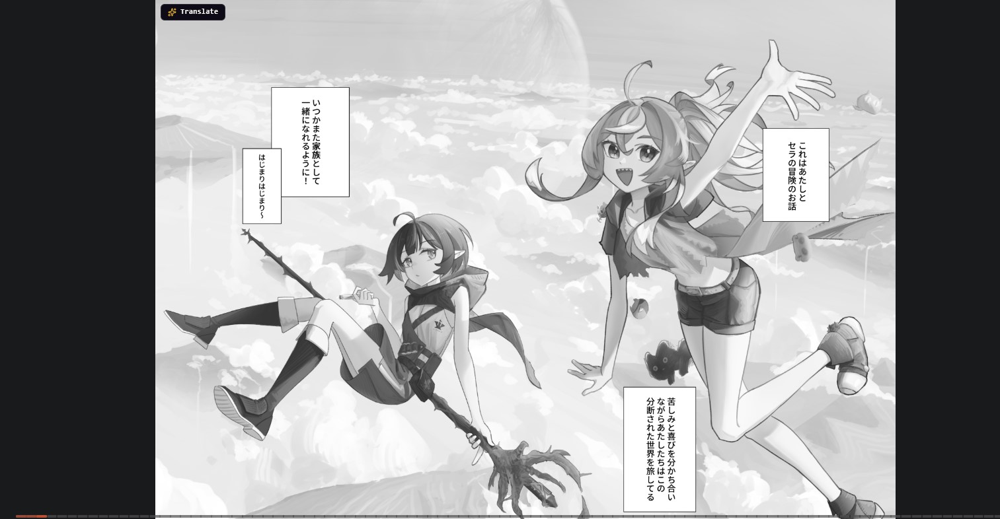
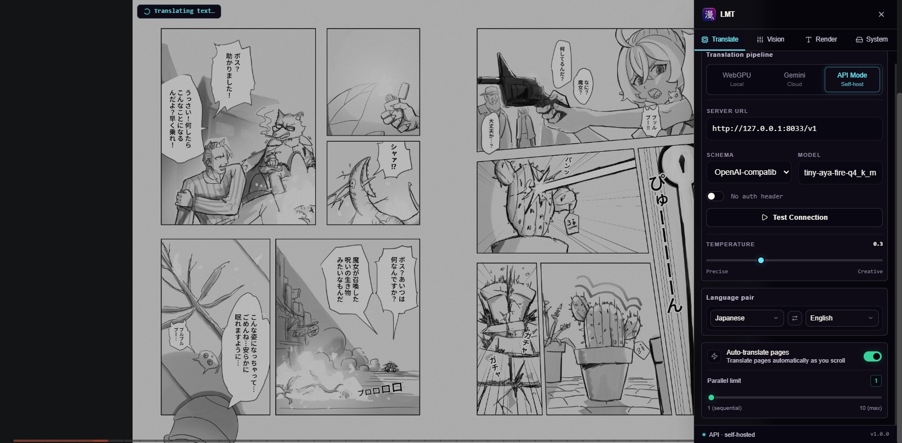
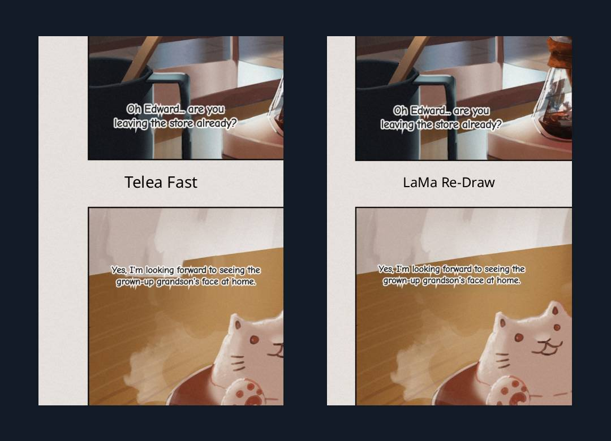
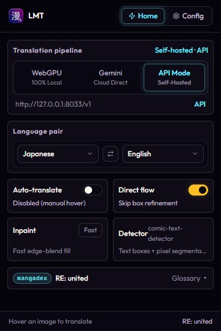
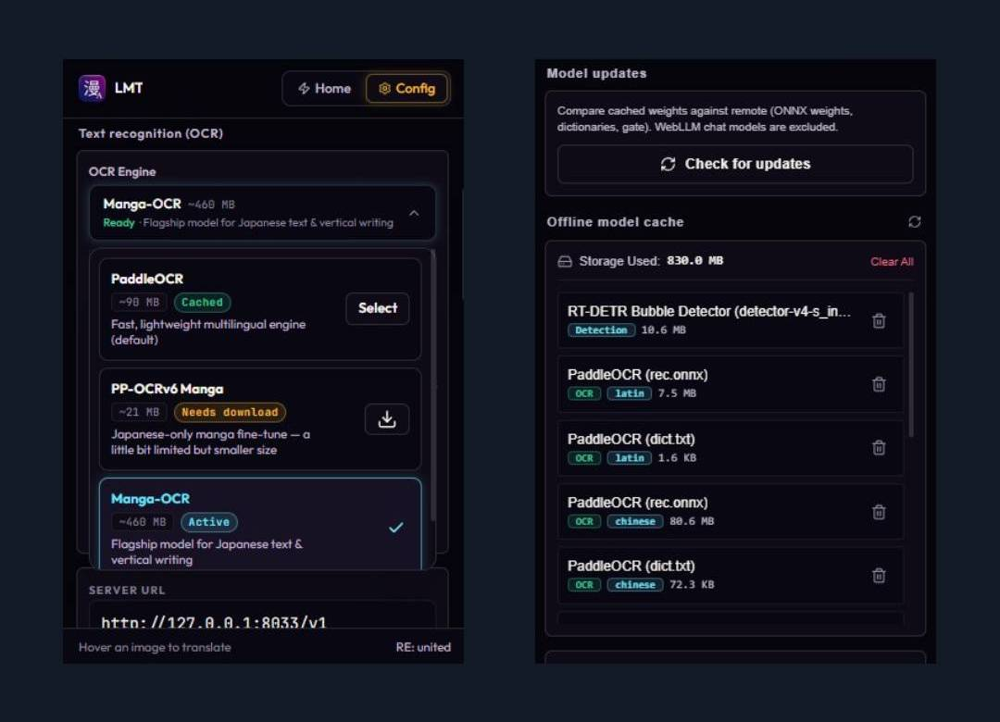
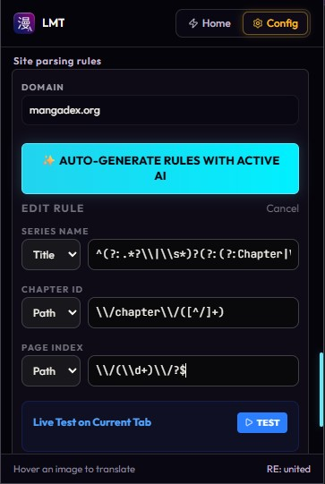

<div align="center">
  
  <h1>Libre Manga Translator</h1>
  <p><i>"Translate manga directly in your browser: 100% on-device (WebGPU), cloud (Gemini), or self-hosted LLM backends"</i></p>

  <p>
    
    
    
    
    
  </p>
</div>

Translate manga in your browser with freedom to choose how. Run everything on your device, offload to the cloud, or point at your own self-hosted LLM backend - **you decide where your data goes**.

> Originally based on the pipeline concept of **[ComicTL](https://github.com/kiuyha/ComicTL)** by Ketut Shridhara and routing ideas from the experimental [Local Manga Translator](https://github.com/mrdhnto/local-manga-translator) proof-of-concept. LMT is an independent, extensively rewritten evolution — modernizing the runtime, vision models, inpainting ladder, and reader workflows. See [Credits & Attribution](#credits--attribution) for full lineage.

---

## Three Translation Modes, One Pipeline

**WebGPU Mode** (default, fully local) runs everything on-device. A WebLLM model (Gemma3-1B, Qwen3.5-2B, or Qwen3.5-4B) translates **with WebGPU (GPU) acceleration**; bubble detection and PaddleOCR text extraction run locally on the CPU (WASM). No API key, no account, no uploads. Works completely offline after the initial model download.

**Gemini Mode** (cloud, opt-in) sends the annotated image to Google's Gemini API, which handles both OCR and translation in one call. Your API key goes straight from your browser to Google - no proxy, no middleman.

**API Mode** (self-hosted) connects to your own LLM server (Ollama, LM Studio, or any OpenAI-compatible endpoint) running locally or remotely. Uses local PaddleOCR for text extraction, then sends only the extracted text to your server for translation - no image leaves your machine in this mode. Full control over the model and infrastructure.

*Libre - you choose where your data goes. Toggle back to the original image any time.*

---

## Showcase & Visual Proof

<details open>
<summary>📸 <b>Translation Proof: Raw vs Translated</b></summary>

| Original Raw Manga Page | Translated Result (Inpainted + Rendered) |
| :---: | :---: |
|  |  |

</details>

<details>
<summary>⚡ <b>In-Page Reader Experience & Automation</b></summary>

| Hover Translation Trigger Pill | Continuous Scroll Auto-Translate |
| :---: | :---: |
|  |  |

</details>

<details>
<summary>✏️ <b>Interactive Bubble Editor & Translation Refinement</b></summary>

| Bounding Box Refinement & Reading Order | In-Place Translation & OCR Inspection Modal |
| :---: | :---: |
|  |  |

</details>

<details>
<summary>🎨 <b>Adaptive Inpainting & Redraw Quality</b></summary>

| Neural LaMa Redraw vs Clean Art Recovery | Inpainting Ladder Controls |
| :---: | :---: |
|  |  |

</details>

<details>
<summary>⚙️ <b>Control Panels & Model Management</b></summary>

| On-Page Sliding Sidebar | Extension Popup Quick Pick |
| :---: | :---: |
|  |  |

| Offline Model Storage & Cache Manager | Site Rule Generator & Custom Adapters |
| :---: | :---: |
|  |  |

</details>

---

## How It Works

Libre Manga Translator coordinates vision, OCR, translation, and inpainting through a streamlined browser pipeline:

1. **Bubble Detection** — RT-DETR or ComicTextDetector scans the manga page on-device inside an isolated offscreen document, producing accurate bounding boxes sorted in manga reading order (right-to-left, top-to-bottom).
2. **Review & Refinement (Optional)** — An interactive on-page editor lets you resize, merge, create, or delete bubbles before translation. Enable *Skip bbox refining* or *Auto-translate* to bypass this step completely.
3. **Script Verification & OCR** — An on-device script-identification gate inspects detected regions to ensure they contain the target language. Sound effects, art, and foreign text are held back. Multilingual PaddleOCR, PP-OCRv6 Manga, or Manga-OCR extracts text with coordinate tracking.
4. **Translation Routing** — Text routes to your selected backend: 100% on-device WebGPU (WebLLM Gemma3 / Qwen3.5), your self-hosted LLM server via API Mode (Ollama / LM Studio), or Google's Gemini API.
5. **Adaptive Inpainting** — A multi-stage inpainting ladder fits a text-shaped mask per region and uses the lightest suitable cleaner (planar fill → bilateral denoise → Telea, or neural LaMa redraw for complex art), ensuring clean text removal without ghost rectangles.
6. **Typesetting & Rendering** — Translated text is automatically wrapped, sized, and rendered on the image canvas using bundled manga fonts or custom user-uploaded typography.

> 📊 **Detailed Architecture:** Detection and model execution run entirely in an isolated offscreen document, keeping heavy tensor inference off the main page thread. For the complete Mermaid pipeline diagram, model weights, and technical specifications, see **[docs/technical.md](docs/technical.md)**.

---

## Features

### 🎯 Translation Modes & Flexibility
- **Full Local Pipeline (WebGPU):** Comic Bubble Detector (RT-DETR, default) and Comic Text Detector run via ONNX Runtime Web. PaddleOCR extracts text on-device. Gemma3-1B, Qwen3.5-2B, or Qwen3.5-4B translates via WebLLM with GPU acceleration. After the initial weights download, the entire workflow operates completely offline.
- **Cloud Direct (Gemini):** Send annotated crops directly from your browser to Google's Gemini API with your own API key. Best for low-resource hardware without a dedicated GPU or when seeking state-of-the-art multimodal translation accuracy.
- **API Mode (Self-Hosted):** Connect to your own LLM server running locally or across your LAN/WAN. Supports Ollama, LM Studio, vLLM, OpenRouter, Venice AI, and any OpenAI-compatible `/v1/chat/completions` endpoint.
- **Dual Schema Support:** Seamlessly switch between standard OpenAI JSON (`response_format.json_object`) and LM Studio experimental format (`input` array + `system_prompt`) without modifying your underlying models.

### 👁️ Vision, Detection & OCR
- **On-Device Detectors:** Choose between RT-DETR-v2 (default, 11.1 MB, fast bubble & text detection) and Comic Text Detector with pixel-mask segmentation (94.7 MB, dense bubble seeding).
- **OCR Engine Choice:** Pick the ideal reader in **Vision › OCR**:
  - **PaddleOCR** (~90 MB): Fast multilingual generalist with 11 language packs (Latin + Chinese/Japanese ship at setup; Korean, Thai, Arabic, Hindi, etc., load on first encounter).
  - **PP-OCRv6 Manga** (~21 MB): Lightweight fine-tune optimized specifically for Japanese manga text.
  - **Manga-OCR** (~460 MB): Flagship model for vertical writing, stylized lettering, and complex Japanese typography.
- **Intelligent Script Gate:** An on-device script-identification model checks every bubble before translation. Non-target text, sound effects (SFX), and artwork lettering remain untouched with a dashed indicator and an optional one-click *Translate anyway* override.

### 🎨 Inpainting & Typography
- **Fast Inpainting Ladder (Default):** Fits text-shaped masks and chooses the lightest suitable cleaner: planar paper-sampling fill on flat backgrounds, bilateral denoise on grainy scans, and Telea fast-marching only where true reconstruction is needed. Prevents ghost boxes, halos, and washed-out artifacts.
- **Quality Neural Inpainting (LaMa):** Deep-learning redraw for complex screentones, halftones, and textured art behind text. Runs a standalone LaMa pass with automatic fallback into the Fast ladder for declined regions.
- **Custom Typography:** Ships with comic and manga fonts (Noto Sans, Bangers, Comic Neue) and allows dropping in any custom TTF, OTF, or WOFF font file with automatic font scaling.
- **Compare & Export:** Instant toggle between original and translated artwork, plus one-click JPEG export of the final translated page.

### 📖 Reader Experience & Automation
- **Floating Hover Trigger:** Hover any manga image (`>= 260px`) to reveal a low-profile pinned **Translate** pill. After translation, it transforms into an unobtrusive action hub for editing, adjusting boxes, or toggling view modes.
- **Continuous Auto-Translate:** Automatically detects and translates chapter pages as they scroll into the viewport with sequential queue management to prevent VRAM or API rate exhaustion.
- **Interactive Box Editor:** Drag, resize, create, delete, and undo/redo bounding boxes arranged in right-to-left manga reading order.
- **In-Place Translation & OCR Editor:** Inspect extracted OCR text side-by-side with translations in an edit modal. Modify translations on the fly and re-render directly to canvas without re-running inpainting.
- **Series Context & Continuity:** Preserves series title, character glossaries, and the last 5 translated bubbles across chapter pages for terminology consistency.
- **Site Rule Adapters:** Regex-based rules detect series names, chapters, and page numbers across popular manga sites, with an integrated AI rule generator to create new adapters in seconds.

### 🛡️ Privacy, Security & Control
- **100% Zero Telemetry:** No analytics, no pingbacks, no tracking pixels, and no improvement uploads. Your reading activity stays entirely on your machine.
- **Hardened Image Proxy:** Background proxy (`PROXY_IMAGE`) enforces strict allowlisting on `http(s)` URLs, blocking loopback, RFC1918 private IPs, cloud metadata addresses, and internal schemes.
- **Universal CORS & Anti-Hotlink Fallback:** Automatically circumvents CDN referer checks and Cloudflare protection via background declarativeNetRequest headers.
- **Model Storage & GPU Controls:** Manage downloaded weights, view cache allocations, purge models, and toggle WebGPU/WASM acceleration per subsystem in **System › GPU Acceleration**.
- **Detailed Diagnostics:** Exportable session logs detailing timings, OCR text, inpainting statistics, and error traces without storing image or base64 payloads.

---

## Installation

### From Source (Current Development Version)

Requires [Bun](https://bun.sh).

```bash
git clone https://github.com/mrdhnto/libre-manga-translator.git
cd libre-manga-translator
bun install

# Development with hot reload
bun run dev           # Chrome
bun run dev:firefox   # Firefox

# Production build
bun run build
bun run build:firefox
```

Copy `.env.example` to `.env` and fill in the values before building.

### Chrome

1. Build the project: `bun run build`
2. Open `chrome://extensions`
3. Enable **Developer mode** (toggle in the top right)
4. Click **Load unpacked** and select the `.output/chrome-mv3/` folder

### Firefox

1. Build the project: `bun run build:firefox`
2. Open `about:debugging#/runtime/this-firefox`
3. Click **Load Temporary Add-on**
4. Select any file inside the `.output/firefox-mv2/` folder

> Firefox temporary add-ons do not survive a browser restart. A signed Firefox release is planned for a future version.

### First-time setup

Open the extension popup and go through the onboarding flow, or go to **Settings** directly.

- **WebGPU Mode:** Select WebGPU in the Home tab and let the model weights download once. Roughly 0.8–4 GB depending on which LLM you pick (Gemma3-1B, Qwen3.5-2B, or Qwen3.5-4B).
- **Gemini Mode:** Paste your Gemini API key (free at [aistudio.google.com](https://aistudio.google.com)), then set the mode to Gemini in the Home tab.
- **API Mode:**
  1. Select API Mode in the Home tab
  2. Choose your schema (OpenAI or LM Studio)
  3. Set the Host URL (e.g. `http://127.0.0.1:11434/v1` for Ollama or `http://127.0.0.1:1234/api/v1` for LM Studio)
  4. Enter your model name (e.g. `qwen3.5:4b`)
  5. Click **Test Connection** to verify

---

## Quick Start

1. Open any manga page in Chrome or Firefox
2. Hover a page image and click the floating **Translate** pill (or click the LMT icon and **Translate Active Page**)
3. The overlay opens and runs bubble detection automatically
4. Adjust any boxes that were missed or drawn wrong (skip this step if `Skip bbox refining` or `Auto-translate` is on)
5. Click **Confirm**
6. Read, or use the results toolbar:
   - **Edit:** Adjust translations or fix typos with live canvas re-render
   - **Refine Boxes:** Go back to adjust bubble coordinates and re-translate
   - **Save JPG:** Export full-resolution translated image
   - **Original toggle:** Swap between raw page and translated result

---

## API Mode Setup Guide

### Recommended: Ollama

1. **Install Ollama:** Download from [ollama.com](https://ollama.com)
2. **Pull a model:** `ollama pull qwen3.5:4b`
3. **Configure LMT:**
   - Host: `http://127.0.0.1:11434/v1`
   - Schema: OpenAI
   - Model: `qwen3.5:4b`

### Alternative: LM Studio

1. **Download LM Studio:** Install from [lmstudio.ai](https://lmstudio.ai)
2. **Download a model:** Search for and download a text model like `tiny-aya-global`
3. **Start Local Server:**
   - Go to the **Local Server** tab
   - Select your model
   - Click **Start Server**
4. **Configure LMT:**
   - Host: `http://127.0.0.1:1234/api/v1`
   - Schema: LM Studio (Experimental)
   - Model: match what you loaded in LM Studio

### OpenAI-Compatible Services

Any service exposing `/v1/chat/completions` works:
- **OpenRouter:** `https://openrouter.ai/api/v1`
- **Venice AI:** `https://api.venice.ai/api/v1`
- **Together AI:** `https://api.together.xyz/v1`

---

## Adding Site Support (Pull Requests Welcome)

LMT figures out the series name, chapter ID, and page index for each URL using site adapter rules. Most manga sites are not covered yet.

Adding one is the shortest contribution you can make to this project, and it helps everyone who reads on that site.

### Where rules live

There are two places, with clear separation:

- **`src/lib/adapters/`** - community adapters. One file per site, auto-imported at build time. This is where your PR goes. No registry edits, no build config - drop a file in and the next build bundles it.
- **`src/lib/adapters.ts`** - trusted core, maintained by the LMT maintainers for long-trusted, stable sites. If your adapter becomes a community staple, it may graduate here.

Precedence on domain conflicts: user custom rules > trusted core > community adapters.

### What an adapter looks like

```typescript
// src/lib/adapters/mangadex.ts

// One file per site. Auto-imported at build time.
// See src/lib/adapters/README.md and _example.ts.
export default {
  id: "mangadex",
  domain: "mangadex.org",
  seriesName: {
    regex: "^(?:.*?\\|\\s*)?(?:(?:Chapter|Vol)[^\\-]+\\-\\s*)?(.*?)\\s*\\-\\s*MangaDex",
    source: "title",     // extract from document.title
  },
  chapterId: {
    regex: "\\/chapter\\/([^/]+)",
    source: "path",      // extract from window.location.pathname
  },
  pageIndex: {
    regex: "\\/(\\d+)\\/?$",
    source: "path",
  },
  containerSelector: ".md--reader-chapter", // selector for the page container (adapter for automatic translation)
  imageSelector: ".md--page img.img, .md--reader-chapter img[src^='blob:']", // selector for the images that need to be processed (adapter for automatic translation)
} satisfies SiteRule;
```

Each field needs a `regex` with exactly one capturing group and a `source` (`"title"` for `document.title`, `"path"` for `window.location.pathname`).

### You do not need to write the regex by hand

Open any chapter on the site you want to support, click the LMT icon, and use the **AI rule generator** in Settings. It reads the current page title and URL, sends them to whichever AI you have active (WebGPU, Gemini, or API), and returns a draft rule you can paste straight into your adapter file.

The one rule: the regex has to work for any manga on that site, not just the one you tested on. Verify it against at least two different series before submitting.

### Submitting

1. Fork the repo
2. Copy `src/lib/adapters/_example.ts` to `src/lib/adapters/<site-domain>.ts` and fill it in
3. Open a PR with the site name in the title

That is it. The next build picks the file up automatically - no registry to edit.

---

## Detection Models

Two selectable detectors, all on-device: Comic Bubble Detector RT-DETR (default, 11.1 MB, bubbles + free text) and Comic Text Detector with pixel-mask seeding (94.7 MB, denser bubbles + free text). Switch in **Vision › Detection** (popup `Home` quick pick or sidebar/popup settings, `ModelSelect` with `Cached`/download). Min Confidence 0.5. YOLO26 models were removed post-rework; stored `yolo26n`/`yolo26s` ids auto-migrate to the RT-DETR default via `normalizeDetectionModel()`.

Full table with licenses and weight links: [docs/technical.md](docs/technical.md).

---

## Tech Stack

WXT + Svelte 5 + TypeScript + Tailwind CSS. On-device detection (RT-DETR / ComicTextDetector), OCR (PaddleOCR / PP-OCRv6 Manga / Manga-OCR), and Fast inpaint ladder (planar fill / denoise / Telea) or Quality LaMa-first pass via ONNX Runtime Web; WebLLM (Gemma3 / Qwen3.5), Gemini, or self-hosted LLM for translation. Bun for builds.

Full layer table: [docs/technical.md](docs/technical.md).

---

## Project Structure

Standard WXT layout: `src/entrypoints/` (background, content + auto-translate/registry, offscreen, popup `Home`+`Settings`, setup) + `src/lib/` (security, hardware, manifests, server/validator, detections, OCR, gate, inpaint, gemini, server, adapters, canvas, components/overlay + settings + ui/ModelSelect) + `scripts/` self-checks.

Full annotated tree: [docs/technical.md](docs/technical.md).

---

## Roadmap & Status

LMT is under active development. Releases are intentionally infrequent while
the pipeline stabilizes - this section reflects what's actually being worked
on right now, not just a wishlist. Check the [commit history](../../commits/development)
for day-to-day activity between releases.

### ✅ Released (Stable v1.0.0)

The v1.0.0 release establishes LMT as a production-grade, offline-first manga translation suite with modular vision, OCR, and language models:

- **Unified Routing Architecture** — Full on-device WebGPU execution (WebLLM Gemma3 / Qwen3.5), self-hosted API integration (Ollama, LM Studio, OpenAI-compatible), and direct cloud Gemini translation.
- **On-Device Vision & Bubble Detection** — Integrated RT-DETR-v2 and ComicTextDetector with deterministic region ordering and an interactive on-page bounding box editor.
- **Multilingual OCR & Script Verification** — In-tree PaddleOCR runtime with 11 language packs, Japanese-specialist Manga-OCR, PP-OCRv6 Manga fine-tune, and an on-device script verification gate to prevent mistranslating sound effects or background art.
- **Adaptive Inpainting Ladder** — Model-free multi-rung inpaint engine (planar fill, bilateral denoise, Telea) combined with optional deep-learning LaMa redraw to eliminate ghost rectangles and clean art behind text.
- **Integrated Reader Experience** — Zero-flicker hover translation trigger, continuous scroll auto-translation, in-place OCR and translation editing, and one-click image export.
- **Security & Privacy Hardening** — Zero telemetry, completely local execution in WebGPU mode, SSRF-guarded image fetching, strict response schema validation, and SHA-256 model integrity verification.

### 🔧 In Progress

- *Intermitten API Contract Fail* - Sometimes the API response fails with different bubbles count from the request.
- *Stable Version Firefox AMO* - Porting current rework to Firefox firefox-wllama branch and updating the store.
- *Chrome Webstore* - Chrome Webstore submission still in review.

### 🐛 Known Issues (actively investigating)

- *OCR reliability on Manhwa / Webtoon text* - text extraction intermittently fails on Korean formats. Either the Model Limitation or the configuration needs to be adjusted.

Found a bug not listed here? Open an issue - it helps prioritize.

### 🗺️ Planned

- *Automatic Test Cases* - automated tests for the core engine, pipeline, site adapters, and model management.
- More community site adapters

---

*Status as of September 2026. This list changes as issues are found and fixed
during dev testing - it's not a fixed commitment, just where things stand.*

---

## Contributing

This is a community-driven project. Whether you are a developer or a manga reader with a great idea, contributions are welcome.

- Found a bug? Open an issue.
- Have a feature idea? Start a discussion.
- Want to code? Submit a Pull Request.

The easiest place to start is a **site adapter PR** - add support for your favorite manga site in about three minutes.

---

## Credits & Attribution

### Lineage & Foundations
This project began as an evolution of **[ComicTL](https://github.com/kiuyha/ComicTL)** by Ketut Shridhara. ComicTL established the early viability of in-browser manga translation, contributing:
- RT-DETR / YOLO bubble detection pipeline and ONNX Runtime Web integration
- PaddleOCR on-device text extraction with coordinate mapping
- Initial WebLLM translation foundation (via WebGPU)
- Interactive bubble editor with undo/redo and reading-order sort
- Series context and custom glossary system
- Site adapter framework with AI rule generation
- Gemini cloud translation path

### Architecture & Independent Evolution
Following the initial fork, LMT underwent an extensive architectural rewrite (~70%+) to address browser constraints, stability, and reader ergonomics:
- **Core Architecture & Performance** — Modular offscreen document isolation for non-blocking UI, cooperative event-loop scheduling (`scheduler.yield`), and Svelte 5 runes migration.
- **Self-Hosted API Mode** — Native support for local/remote LLM servers (Ollama, LM Studio, OpenAI-compatible) with dual JSON schema parsing and live connection testing (inspired by the experimental [Local Manga Translator](https://github.com/mrdhnto/local-manga-translator) PoC).
- **Adaptive Inpainting Ladder** — Independent multi-stage cleaning pipeline (planar fill, bilateral denoise, Telea) and deep-learning LaMa redraw to prevent flat-patch and ghost-box artifacts (techniques inspired by architectural concepts in [Manga Cleaner](https://github.com/k-omiq/manga-cleaner) by KoMiQ).
- **Language Verification Gate** — On-device script identification to prevent mistranslating sound effects and artwork lettering.
- **Reader Ergonomics** — Pinned hover translation pill, continuous scroll auto-translation, in-place OCR/translation editing, and one-click image export.

### Key components and libraries

Detection (RT-DETR, ComicTextDetector), script gate (OSD LSTM), OCR (PaddleOCR, PP-OCRv6 Manga, Manga-OCR), inpainting (Fast ladder + optional Quality LaMa), local translation (WebLLM Gemma3 / Qwen3.5). Built on WXT + Svelte 5 + TypeScript + Tailwind CSS (see `LICENSE` appendix for the full linked-library table).

Full per-model table with sizes, licenses, and weight links: [docs/technical.md](docs/technical.md). Full upstream/technique/library attributions: [LICENSE](LICENSE) appendix.

---

## License

[AGPL-3.0-or-later](LICENSE)

From version 1.0.0 Stable the project is licensed under the GNU AGPL-3.0-or-later. Copyleft guarantees this fork stays open: anyone may redistribute or build on it, but every distributed or network-hosted derivative must keep its complete source available under the same terms. Beta releases through v1.0.0-Beta5 were MIT-licensed (see their tags). See [LICENSE](LICENSE) for the full text and attribution appendix.

Copyright (C) 2026 Libre Manga Translator. This program is free software under the
GNU Affero General Public License v3 (or later). The appendix in [LICENSE](LICENSE)
lists upstream codebases, technique inspirations, linked libraries, on-demand model
weights, and fonts.

This project is a derivative work. Upstream notices are preserved in `LICENSE`:
ComicTL codebase © 2025-2026 Ketut Shridhara (MIT — combined work conveyed under AGPL);
LMT additions © 2026 Libre Manga Translator.

**Third-party model weights (on-demand, never bundled):**
- Weights download only when needed to the user's local browser cache and follow their upstream licenses (see table in `LICENSE` / `docs/technical.md`).
- `comictextdetector.pt.onnx` is **GPL-3.0** by dmMaze / manga-image-translator: selected explicitly by the user, fetched straight from the upstream public release. LMT's client wrapper is an independent TypeScript implementation conveyed under AGPL-3.0; no upstream code was copied.

---

## Disclaimer

This project is for personal use and educational exploration of flexible AI deployment in browser extensions. Always support the official releases of the manga you read.
