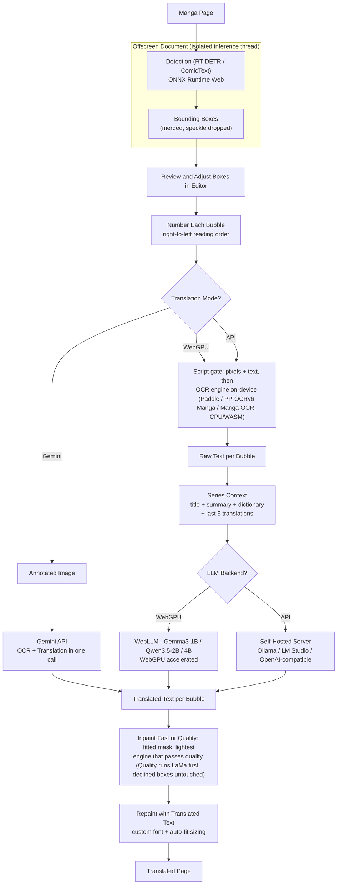

# LMT Technical Reference

Developer-facing details for Libre Manga Translator: models, settings, pipeline internals, project layout, and checks. The user-facing overview lives in [`README.md`](../README.md).

## Contents

- [LMT Technical Reference](#lmt-technical-reference)
  - [Contents](#contents)
  - [Tech Stack](#tech-stack)
  - [Pipeline](#pipeline)
  - [Detection Models](#detection-models)
  - [Detection Settings](#detection-settings)
  - [OCR Engines](#ocr-engines)
  - [Inpainting: Fast Ladder \& Quality Mode](#inpainting-fast-ladder--quality-mode)
    - [1. Fast Mode (The Model-Free Engine Ladder, Default)](#1-fast-mode-the-model-free-engine-ladder-default)
    - [2. Quality Mode (Standalone Neural LaMa Redraw, Opt-In)](#2-quality-mode-standalone-neural-lama-redraw-opt-in)
    - [Quality Metric \& Rollback](#quality-metric--rollback)
  - [Script Gate](#script-gate)
  - [Model Storage \& Cache Management](#model-storage--cache-management)
  - [Security Hardening](#security-hardening)
  - [Auto-Translate Engine](#auto-translate-engine)
  - [GPU Controls](#gpu-controls)
  - [Environment Overrides](#environment-overrides)
  - [Project Structure](#project-structure)
  - [Debug Logging \& Sensitive Data](#debug-logging--sensitive-data)
  - [Checks](#checks)
  - [Model \& Runtime Licenses](#model--runtime-licenses)
    - [Runtime libraries and bundled assets](#runtime-libraries-and-bundled-assets)

## Tech Stack

| Layer | Technology |
|---|---|
| Extension framework | [WXT](https://wxt.dev) |
| UI | [Svelte 5](https://svelte.dev) with runes |
| Language | TypeScript |
| Styling | Tailwind CSS |
| Bubble / text detection | RT-DETR ONNX + ComicTextDetector ONNX via ONNX Runtime Web (`onnxruntime-web`) |
| Script gate | OSD script-identification LSTM (~3.7 MB, ONNX Runtime Web) + Unicode-block text verification |
| On-device OCR | PaddleOCR ONNX (`~90 MB` Latin + Chinese/Japanese packs, multilingual default), PP-OCRv6 Manga ONNX (`~21 MB`, Japanese-only manga fine-tune) or Manga-OCR ONNX (`~460 MB`, Japanese flagship) |
| Inpainting | Fast model-free engine ladder (Rung 0: Planar fill, Rung 1: Bilateral denoise, Rung 2: Telea) + independent Quality mode (standalone neural LaMa redraw, `~207 MB`, with Fast ladder fallback) |
| Local translation | Chrome: [WebLLM](https://webllm.mlc.ai/) (Gemma3-1B / Qwen3.5-2B / Qwen3.5-4B) · Firefox: [wllama](https://github.com/ngxson/wllama) (Qwen3.5-4B / Tiny Aya GGUF) |
| Cloud translation | Gemini API via REST |
| API Mode backends | Ollama, LM Studio, OpenAI-compatible |
| Storage | WXT storage (wraps chrome.storage); model weights in browser cache (see below) |
| Build | Bun + WXT |
| License (program) | AGPL-3.0-or-later (see `LICENSE`; weights on-demand per upstream license) |
| Telemetry | None (100% offline-first, zero tracking) |

Runtime dependencies are minimal by design (`package.json`): `@mlc-ai/web-llm` (Chrome builds only — excluded from Firefox via build-time `import.meta.env.FIREFOX` branches), `@wllama/wllama` (Firefox builds only), `onnxruntime-web`, `lucide-svelte`. No OpenCV.js / no WASM inpainting dependency — the ladder is pure TypeScript plus optional ONNX LaMa.

## Pipeline



```
detect (RT-DETR / ComicTextDetector) → refine regions (merge/size)
  → script gate + OCR (PaddleOCR / Manga-OCR) → translate
  → inpaint (auto ladder + optional LaMa) → paint
```

Mode determines the translate step:

- **webgpu** → `textRecognise()` → local LLM (Chrome: `translateLocal()` via WebLLM MLC; Firefox: `translateWithWllama()` via wllama GGUF — see [Local LLM backends](#local-llm-backends))
- **api** → `textRecognise()` → `translateWithServer()` (HTTP to external server)
- **gemini** → `translateWithGemini()` (annotated image to Google, skips OCR)

## Local LLM backends

WebGPU mode runs fully on-device. The engine is per-browser (Firefox-only swap — Chrome keeps MLC weights, so existing Chrome users never re-download):

| Build | Engine | Models | Weights | Backend code |
|---|---|---|---|---|
| Chrome | WebLLM (`@mlc-ai/web-llm`) | Gemma3-1B / Qwen3.5-2B / Qwen3.5-4B `q4f16_1-MLC` | 0.8–4 GB via WebLLM cache | `src/lib/webllm.ts` |
| Firefox | wllama (`@wllama/wllama`, MIT) | Qwen3.5-4B `IQ4_XS` / Tiny Aya Global `q4_k_m` GGUF | ~2.3 / ~2.0 GB (`unsloth/Qwen3.5-4B-GGUF` via env `WXT_GGUF_MODEL_REPO`, `CohereLabs/tiny-aya-global-GGUF`) via shared CacheStorage | `src/lib/wllama.ts` |

Selection: `llmModelDef()` / `visibleLlmModels()` in `src/lib/configs.ts` (stored `sync:llm-model` ids resolve with cross-engine fallback); the shared handlers route in `translateLocalRouted` / `makeSiteRuleLocalRouted` (`src/lib/inference.ts`, executed in the offscreen document on Chrome and in `offscreen.html` inside a hidden background-page iframe on Firefox). Both backends serve the same `TranslateResult` shape with the same `response_format` JSON-schema contract (`json_schema` on wllama, `json_object` fallback, then unconstrained + `parseLlmJson`), validated by `validateTranslationResult`; Qwen thinking mode is disabled via `chat_template_kwargs` when the template supports it. GGUF download/delete flows through the existing model-cache plumbing (`fetchAndCacheWithProgress`, `local:cached-llms`, Model Storage UI), so no new storage keys were needed. Per-request token stats (`LlmPerf`) and WebGPU-fallback reasons surface in the debug log.

Chunk budget (Firefox AMO allows max ~2 MB per `.js`): `wxt.config.ts` forces terser and isolates `onnxruntime-web` / `@mlc-ai/web-llm` / `@wllama/wllama` into `ort-*` / `webllm-*` / `wllama-*` chunks via the `lmt-vendor-chunk-guard` plugin (a static `manualChunks` would break WXT's single-file background/content builds, so the plugin drops it when `inlineDynamicImports` is set). Both LLM vendors are dynamic-only at their use sites (`lib/webllm.ts`, `lib/wllama.ts`, setup page, inference cache handlers) so they ship as lazy async chunks. Each LLM-vendor import additionally sits behind a build-time `import.meta.env.FIREFOX` branch: dead-branch elimination ships web-llm **only** in Chrome builds and wllama (+8.4 MB `.wasm` asset, not `.js`) **only** in Firefox builds. The background entry stays lean by construction: it never statically imports `lib/inference.ts` (that would inline ORT + the whole pipeline into single-file `background.js`) — Firefox runs inference in `offscreen.html` inside a hidden background-page iframe sharing the pages build's split chunks (`background/utils.ts` `ensureFirefoxInferencePage`). Result: `firefox-mv2` has no `webllm-*` chunk and every `.js` stays under the limit (guard: `bun scripts/check-bundle-size.ts .output/firefox-mv2`). wllama's worker runs from a bundled blob URL (`worker-src 'self' blob:` CSP on Firefox builds only — Chrome keeps the strict Web Store policy).

Shared prompts live in `src/lib/prompts.ts` (`buildTranslationPrompts`, `buildSiteRulePrompts`), used by both `webllm.ts` and `server/main.ts`. The offscreen document (`src/entrypoints/offscreen/main.ts`) switches on `currentMode` and serves `OFFSCREEN_*` handlers (WebGPU probe, model prefetch). Background (`src/entrypoints/background/index.ts`) forwards messages and handles `TEST_BACKEND`, `PREFETCH_MODEL` (legacy alias) / `START_MODEL_DOWNLOAD` (acked, with progress), `GET_MODEL_STATUSES` / `GET_ACTIVE_DOWNLOADS`, `GPU_STATE_CHANGED` / `CHECK_WEBGPU_SUPPORT`, and `PROXY_IMAGE` (SSRF-gated, see below).

Content entry (`src/entrypoints/content/index.ts`) mounts the overlay, the sidebar (floating cog), and the hover floating trigger (`FloatingTrigger.svelte`, isolated ShadowRoot). Translation status is deduped through `src/entrypoints/content/translation-registry.ts` so hover, auto-translate, and popup actions never double-translate the same image.

Detection never sends an image anywhere. Detection and OCR run in a dedicated offscreen document, keeping inference off the page thread and away from the popup UI.

## Detection Models

Two selectable detectors. Switch in **Vision › Detection › Model Selection** via the shared `ModelSelect` component (options from `DefaultConfig.detectionModels` in `src/lib/configs.ts`; per-model `Cached` badge plus inline download with streaming progress).

| Model | Size | License | Notes |
|---|---|---|---|
| Comic Bubble Detector (RT-DETR-v2, default) | 11.1 MB | Apache-2.0 | `ogkalu/comic-text-and-bubble-detector`. Detects `bubble`, `text_bubble`, `text_free`. Good at bubbles and free-floating text. |
| Comic Text Detector & Segmentation | 94.7 MB | GPL-3.0 | `comictextdetector.pt.onnx` (dmMaze via manga-image-translator beta-0.3). Returns text boxes plus a per-pixel segmentation mask (`[1, 1, 1024, 1024]`) upsampled to page resolution; `buildSegmentationSeed` seeds `fitMask()` directly from the mask, falling back to `buildInkSeed` when absent. |

YOLO26-Nano/Small were removed post-rework (`66b018e`). Stored `yolo26n`/`yolo26s` ids auto-migrate to `comic-bubble` via `normalizeDetectionModel()` (`src/lib/configs.ts`); unknown ids throw `UNKNOWN_DETECTION_MODEL_MESSAGE` with setup-wizard directions.

**Weights:**

- RT-DETR: [ogkalu/comic-text-and-bubble-detector](https://huggingface.co/ogkalu/comic-text-and-bubble-detector)
- ComicTextDetector: [dmMaze/comic-text-detector](https://github.com/dmMaze/comic-text-detector) (downloaded on-demand to local browser cache, never bundled)

Inference wrappers: `src/lib/detections/main.ts` (router), `src/lib/detections/rtdetr.ts`, `src/lib/detections/comictext.ts`, `src/lib/detections/segmentation.ts`, `src/lib/detections/boxes.ts` (`refineDetections`: deterministic `(y,x,h,w)` sort, centre-in-box merge, speckle drop, growth tiers, overlap merge).

## Detection Settings

| Setting | Default | Notes |
|---|---|---|
| Model | Comic Bubble Detector (RT-DETR) | RT-DETR default; Comic Text Detector when you want pixel-mask seeding. |
| Min Confidence | 0.5 | Lower catches more bubbles but increases false positives. |
| Model Updates | Manual | Per-model Auto-Update toggle removed post-rework; use **System › Model Storage** update checker (`CHECK_MODEL_UPDATES` / `UPDATE_CACHED_MODEL`). |

Storage key prefix: `sync:detection-*`. Cache keys include the resolved page index plus a `quickHash` of the image source so re-translations of the same page hit the cache reliably (`resolveImagePageIndex` in `src/entrypoints/content/utils.ts`).

## OCR Engines

Selectable in **Vision › Text Recognition (OCR) › OCR Engine** (`src/lib/components/settings/OcrSettings.svelte`, `ModelSelect`). Coordinator: `src/lib/ocr/main.ts`; backends implement `OcrEngine` (`src/lib/ocr/types.ts`): `src/lib/ocr/paddle.ts`, `src/lib/ocr/manga-ocr.ts`.

In-tree runtime: line preprocessing, polarity normalization, CTC decoding, and dictionary matching run in native JS (`src/lib/ocr/paddle.ts`, `src/lib/ocr/utils.ts`); tensor math stays on ONNX Runtime Web (WASM, with WebGPU gating via `src/lib/hardware.ts`). Zero `eval` / `new Function` in `src/lib/ocr/**` — MV3 CSP is `script-src 'self' 'wasm-unsafe-eval'` only (`wxt.config.ts`). Third-party web PaddleOCR packages were audited and rejected (see `docs/ocr-runtime-audit.md`, `bun run check:ocr-audit`).

| Engine | Size | Best for |
|---|---|---|
| PaddleOCR (default) | `~90 MB` (Latin + Chinese/Japanese packs ship at setup) | Fast multilingual generalist. Per-language-group `rec.onnx` + `dict.txt` under `languages/<group>/`, resolved per page by `resolveLangGroup()` (`src/lib/configs.ts`) or the script gate's page majority under Auto-Detect; 9 more packs download on first use. |
| PP-OCRv6 Manga | `~21 MB` | Japanese-only manga fine-tune ([fumetodev/PP-OCRv6_small_rec_manga_ONNX](https://huggingface.co/fumetodev/PP-OCRv6_small_rec_manga_ONNX)) — a little bit limited but smaller size. Same CTC contract as PaddleOCR (48px height, stock ppocrv6 dict + space + blank), fixed file + bundled `public/dicts/ppocrv6_dict.txt` (refresh via `bun run extract-dict`). Limits (per model card): Japanese only; furigana is not suppressed — drop ruby lines before recognition; rare kanji outside the manga distribution and the ♥ glyph are the most common residual errors. |
| Manga-OCR | `~460 MB` | Flagship model for Japanese text & vertical writing (ViT encoder + BERT decoder, 6144 vocab). Handles vertical text and stylized lettering that PaddleOCR drops or misreads. One-time large download. |

Related settings:

| Setting | Default | Notes |
|---|---|---|
| Min Confidence | 0.7 | Lower reads more text but admits background noise. Retry pass runs at `0.7×` on failed crops. Single characters (`length === 1`) demand `≥ max(minConfidence, 0.75)` to suppress noise hallucinations. |
| Language Gate | On | See [Script Gate](#script-gate). |
| Model Updates | Manual | Per-model Auto-Update toggle removed post-rework; use **System › Model Storage** update checker. |

Preprocessing per region (`src/lib/ocr/utils.ts`, `src/lib/ocr/main.ts`): polarity normalization → contrast boost → padding; single-line crops (`min(h, w) < 24px`) go through whole, larger regions are sliced into lines. OCR runs at `recImgHeight: 48`, batch size 4 (`src/lib/configs.ts`). The PaddleOCR session is keyed `repo:file` so per-group packs swap and fixed-file engines keep their session; swaps log `[ocr] swapping/loading rec model`.

Current state: per-language packs ship/fetch automatically (Latin + Chinese/Japanese in onboarding, the rest on first use, overlay names the pack while downloading). Remaining OCR work is recognition quality on Chinese/Korean layouts (manhua / manhwa / webtoon).

## Inpainting: Fast Ladder & Quality Mode

Source: `src/lib/inpaint/` (`mask.ts`, `ring.ts`, `fit.ts`, `fill.ts`, `denoise.ts`, `telea.ts`, `lama.ts`, `ladder.ts`, `quality.ts`, `constants.ts`). Pure TypeScript, no runtime canvas/WASM dependencies. Self-check: `bun run check:inpaint` (`scripts/inpaint-selfcheck.ts`).

LMT provides two independently selectable inpainting pipelines via `sync:inpaint-method`:

### 1. Fast Mode (The Model-Free Engine Ladder, Default)
`inpaintImageAuto` operates without any external neural weights, executing 100% on CPU with zero network downloads. It fits a tight text-shaped mask per region (`buildInkSeed`, or `buildSegmentationSeed` when a Comic Text Detector mask exists) and evaluates rungs in ascending order, stopping at the lightest rung that passes the decline metric:

| Rung | Engine | Characteristics & When It Wins |
|---|---|---|
| 0 | Planar fill | Samples the paper annulus around the text (`measureRing`, least-squares 2D plane fit). Instant clean for flat paper or uniform tones. |
| 1 | Bilateral denoise | 5×5 bilateral filter with range σ scaled to page noise floor. Smoothes grain and JPEG compression artifacts while preserving edges. |
| 2 | Telea fast-marching | Localized fast-marching pixel reconstruction. Pure TypeScript/canvas implementation (MV3 CSP safe, zero `eval`). Wins on gradients and complex backgrounds where fill/denoise decline. |

### 2. Quality Mode (Standalone Neural LaMa Redraw, Opt-In)
`inpaintImageQuality` is **completely decoupled from the Fast ladder** and selected independently in **Render › Inpainting** (`sync:inpaint-method = "quality"`):
- **Deep-Learning Model:** Runs `lama-manga-dynamic.onnx` (~207 MB download, ~500 MB RAM/VRAM, ONNX Runtime Web) across 512² tiles with 128px overlap.
- **Target Use Case:** Complex screentones, halftones, cross-hatching, and textured artwork behind text where procedural algorithms leave blur or texture seams.
- **Decoupled Fallback:** LaMa executes as a standalone first pass. If LaMa errors out, times out, or fails the quality check on a region, **only then** does that region fall back into the Fast engine ladder (Planar fill → Bilateral denoise → Telea). Quality is therefore a strict superset of Fast, while the Fast ladder remains 100% model-free.

### Quality Metric & Rollback
Every attempt in both paths is validated against a single decline metric (`quality.ts`):
- Post-edit interior edge-energy `> 2×` the 32px surrounding context, or tone distribution outside p5–p95 of the paper background triggers an automatic rollback.
- If a method declines, the region climbs to the next ladder rung (or falls back from LaMa to Fast). If all rungs decline, the region is left completely untouched with original pixels preserved and marked with an inpainting-declined badge.

Method picker (`src/lib/components/settings/InpaintSettings.svelte`, under **Render › Inpainting**): **Fast** (model-free ladder, default) / **Quality** (LaMa neural redraw first, with Fast ladder fallback). Per-region provenance (`{method, deviation, thickness, ms}`) and per-rung counts surface in the debug panel.

## Script Gate

Source: `src/lib/gate/` (`charset.ts`, `ctc.ts`, `osd.ts`, `index.ts`). Self-check: `bun run check:gate` (`scripts/gate-selfcheck.ts`, 57 asserts).

Before translating, each region is checked against the source language: a lightweight on-device script-identification model (`ogkalu/image-script-identification`, `~3.7 MB`, `osd_lstm.onnx`) over the actual pixels, confirmed against the recognized text (`cjkShare`, neutral chars never count). Strict when a CJK source is explicit; additive page-majority under Auto-Detect. Held-back regions keep their original text, render with a dashed amber outline, and offer **Translate anyway** (`gateForce` bypass). Toggle: **Settings › OCR › Language Gate** (`sync:script-gate`). A broken or offline gate never blocks translation — it degrades to text-only verification. Gemini mode skips the gate (VLM path).

## Model Storage & Cache Management

**System › Model Storage** (`src/lib/components/settings/ModelStorageSettings.svelte`) lists every downloaded weight with its size plus a language badge parsed from the cached URL (`languages/<group>/` → language badge, otherwise model-name fallback), per-model delete and full cache clear. Detection, OCR, and backend pickers share `src/lib/components/ui/ModelSelect.svelte` (`Cached`/download + progress). Popup and sidebar prefetch OCR weights on language/engine change (source-language loader spins while the pack lands). Onboarding ships Latin + Chinese/Japanese PaddleOCR packs so the script gate flips between them with no mid-translate fetch; other packs download on first use while the overlay names the model being downloaded. Background prefetch (`START_MODEL_DOWNLOAD`, legacy `PREFETCH_MODEL` alias in `src/entrypoints/background/index.ts`) supports all model types so onboarding and settings can warm the cache. Translation results are keyed by series + chapter + resolved page + image hash, so re-opening a page reuses prior OCR/translation work.

## Security Hardening

- **SSRF-gated image proxy:** `PROXY_IMAGE` validates every URL with `isAllowedImageUrl()` (`src/lib/security.ts`) — `http(s)` allowlist only; rejects embedded credentials, loopback/local hostnames, RFC1918 private IPs, link-local/cloud-metadata ranges, integer/hex IP bypasses, and internal schemes; `data:`/`blob:` never proxied from background. Self-check: `bun run check` via `scripts/security-selfcheck.ts`.
- **Strict translation schemas:** `validateTranslationResult(raw, expectedCount)` (`src/lib/server/validator.ts`) enforces `translations: string[]` with exact bbox-count equality plus optional `sourceTexts`/`context` checks; wired into `translateWithServer`, `translateLocal` (with null-content guard), and `translateWithGemini`. Self-check: `scripts/validator-selfcheck.ts`.
- **SHA-256 download integrity:** known-hash manifest (`src/lib/manifests/hashes.ts`) verified in `downloadArtifactHF` (`src/lib/utils.ts`) via Web Crypto; mismatch evicts the cache entry and aborts session creation. Self-check: `scripts/hashes-selfcheck.ts`.

## Auto-Translate Engine

Orchestrator `src/entrypoints/content/auto-translate.ts` (`AutoTranslateOrchestrator` + `AutoTranslateQueue`, sequential `concurrency: 1` default, `WeakSet`/registry dedupe, detached-image skip). Gated by `sync:auto-translate` (default `false`, toggle in popup `Home` and `Vision › Detection` via `AutoTranslateToggle.svelte`); overlay auto-bypasses `refining` when on (same as `skipBboxRefining`). Candidate selection: adapter `imageSelector` within `containerSelector` when the active `SiteRule` provides them, else generic `naturalWidth > 500 && naturalHeight > 500` fallback (`<= 500px` ignored). `IntersectionObserver` (`rootMargin: "200px"`) + `MutationObserver` for lazy chapter pages. Rule fields extended with `containerSelector?`/`imageSelector?` (`src/lib/adapters.ts`, `wxt-env.d.ts`); community adapters carry verified selectors (MangaDex blob-image fix, MangaFire, Comick, WeebCentral, plus `mgeko.cc`, `comix.to`).

## GPU Controls

Shared probe and state live in `src/lib/hardware.ts` (LMT-authored): `checkWebGPUHighPerf()` requests a `high-performance` adapter and caches `true` only (`local:webgpu-supported`); `normalizeGpuState()` merges master + per-area overrides; `resolveExecutionProviders()` returns WebGPU-first or WASM-only. `src/lib/ort.ts` is the provider enforcer. UI: `src/lib/components/settings/GpuAccelerationPanel.svelte` (master `sync:webgpu-master` + `sync:webgpu-overrides {llm,inpaint,ocr}` + re-check probe) in sidebar **System** tab. Background/offscreen handlers: `CHECK_WEBGPU_SUPPORT`, `GPU_STATE_CHANGED`, `OFFSCREEN_*` prefetch/probe.

## Environment Overrides

Copy `.env.example` to `.env` before building. You normally do not need to touch the model entries unless you self-host weights (empty = defaults):

```
WXT_RTDETR_MODEL_REPO=ogkalu/comic-text-and-bubble-detector
WXT_COMIC_TEXT_DETECTOR_URL=https://github.com/zyddnys/manga-image-translator/releases/download/beta-0.3/comictextdetector.pt.onnx
WXT_PADDLE_OCR_MODEL_REPO=monkt/paddleocr-onnx
WXT_MANGA_OCR_MODEL_REPO=mayocream/manga-ocr-onnx
WXT_PPOCRV6_MANGA_REPO=fumetodev/PP-OCRv6_small_rec_manga_ONNX
WXT_LAMA_INPAINT_MODEL_REPO=ogkalu/lama-manga-onnx-dynamic
WXT_GATE_MODEL_REPO=ogkalu/image-script-identification
```

Single typed source at runtime: `src/lib/env.ts` (plus `WXT_GITHUB_REPO` for update links and `WXT_PRIVACY_URL` for onboarding). 7 model keys only — the old `WXT_YOLO_DETECTION_MODEL_REPO` / `WXT_DETECTION_MODEL_REPO` / `WXT_OCR_MODEL_REPO` names are gone.

## Project Structure

```
src/
  assets/
    app.css              # Obsidian Noir dual-theme tokens + button/panel/badge/switch/slider utilities
    fonts/               # Bundled canvas fonts (Noto Sans, Bangers, Comic Neue — OFL)

  entrypoints/
    background/          # Service worker: message router, SSRF-gated PROXY_IMAGE, model prefetch/status, GPU-state handlers
    content/             # Page injection: overlay + sidebar + floating trigger, auto-translate orchestrator, translation-registry dedupe, debug logging, page-index resolution
    content/debug.ts     # Ring-buffer debug logger (OCR/text/timing only, no images)
    content/auto-translate.ts       # Viewport/mutation observers + sequential queue
    content/translation-registry.ts # Strict per-image status registry (idle/pending/done)
    offscreen/           # Isolated document: detection, OCR, gate, LLM inference, inpainting (OFFSCREEN_* handlers)
    popup/               # Extension popup (Home + Settings tabs, 360x540)
    setup/               # Onboarding flow shown on first install

  lib/
    adapters.ts          # Trusted core rules + URL-to-metadata matching + container/image selectors
    adapters/            # Community site adapters (auto-imported at build)
    security.ts          # isAllowedImageUrl SSRF allowlist
    hardware.ts          # WebGPU probe + normalizeGpuState + resolveExecutionProviders
    manifests/hashes.ts  # SHA-256 manifest for model downloads
    models/updates.ts    # Manual update checker (CHECK_MODEL_UPDATES / UPDATE_CACHED_MODEL)
    components/
      Overlay.svelte     # Translation overlay shell (refining/loading/results, cache-aware)
      FloatingTrigger.svelte  # Hover translate pill + post-translation action hub
      Sidebar.svelte     # On-page sliding panel (Translate / Vision / Render / System)
      overlay/           # BubbleRenderer + BubbleEditor + OverlayToolbar + TextEditModal
      settings/          # Detection / Ocr / Backend / Typography / Inpaint / ModelStorage / ModelUpdateChecker / SiteRules / Debug / GpuAccelerationPanel / AutoTranslateToggle
      ui/ModelSelect.svelte  # Shared picker with Cached badge + download/progress
    configs.ts           # Defaults: modes, models, languages, fonts, thresholds, inpaint method, lang-group resolution
    canvas/              # text-fit + inpaint + export helpers (extracted from legacy utils)
    detections/          # main.ts (router) + rtdetr.ts + comictext.ts + segmentation.ts + boxes.ts (merge/size/tiers) + utils.ts
    env.ts               # Single typed source for all WXT_* env vars
    gate/                # Script gate: charset math, CTC convention, OSD session, voting/decision
    gemini/              # Gemini API client and prompt construction
    inpaint/             # Fast ladder + Quality LaMa-first: mask fit, ring stats, planar fill, denoise, LaMa, Telea, decline metric
    ocr/                 # main.ts (coordinator) + types.ts + paddle.ts + manga-ocr.ts + utils.ts (in-tree JS CTC, zero eval)
    ort.ts               # ONNX Runtime init + execution-provider resolution (delegates to hardware.ts)
    prompts.ts           # Shared prompt builders for all backends
    server/              # API Mode: schemas.ts + validator.ts + main.ts (Ollama/LM Studio)
    utils.ts             # Canvas painting, text fitting, bbox math, cache hashing, SHA-256-verified HF download
    webllm.ts            # WebLLM loader and translation interface (validated output)

scripts/
  inpaint-selfcheck.ts   # Inpaint ladder self-check (no framework)
  gate-selfcheck.ts      # Script gate + region build self-check (57 asserts)
  ocr-selfcheck.ts       # OCR preprocessing self-check
  ocr-runtime-audit.ts   # MV3 CSP audit (zero eval/new Function)
  ocr-lang-packs-selfcheck.ts  # 11 groups / 35 langs / HEAD checks
  security-selfcheck.ts  # SSRF URL hardening self-check
  validator-selfcheck.ts # API schema validator self-check
  hashes-selfcheck.ts    # Resource SHA-256 integrity self-check
  extract-ppocrv6-dict.cjs  # Refresh bundled PP-OCRv6 dict
```

## Debug Logging & Sensitive Data

LMT includes an in-memory / local storage ring-buffered debug logger (`src/entrypoints/content/debug.ts`, capped at 50 entries):
- **Local-Only:** Recorded entries reside in `local:debug-logs` in local extension storage.
- **Zero Transmission:** Entries are never transmitted across the network.
- **Sensitive Content Notice:** Debug logs record raw OCR transcripts, prompt text, and translation results from visited pages. Users should not share exported logs publicly if they contain sensitive or private data.

## Checks

```bash
bun install             # install dependencies
bun run check           # svelte-check — must be 0 errors
bun run check:inpaint   # inpaint ladder self-check (scripts/, no framework)
bun run check:gate      # script gate + region build self-check
bun run check:ocr-packs # 11 language groups + 35 langs + model HEAD checks
bun run check:ocr-audit # MV3 CSP audit — zero eval/new Function
bun run extract-dict    # refresh public/dicts/ppocrv6_dict.txt
bun run build           # produces .output/chrome-mv3/
bun run build:firefox   # produces .output/firefox-mv2/
bun run dev             # Chrome, hot reload
bun run dev:firefox     # Firefox, hot reload
bun run zip             # package Chrome extension zip
bun run zip:firefox     # package Firefox extension zip
```

Manual test matrix: WebGPU hover-pill translate; Gemini with API key; API Mode against Ollama (`http://127.0.0.1:11434/v1`) with **Test Connection**; Fast inpaint on flat-paper balloon (no ghost rectangle); Japanese page with a Latin SFX box → dashed amber + **Translate anyway**; auto-translate on a chapter reader (one page at a time, no VRAM OOM).

## Model & Runtime Licenses

LMT's own code is AGPL-3.0-or-later (see `LICENSE`, Copyright (C) 2026 Libre
Manga Translator). No model weights ship with the repository or the release
packages — every weight below downloads on-demand to the user's local browser
cache and follows its upstream license. Full attribution (upstream
codebases, technique inspirations, linked libraries, weights, fonts) lives in
the `LICENSE` appendix.

| Purpose | Model | Upstream | License | Size |
|---|---|---|---|---|
| Bubble detection (default) | `comic-text-and-bubble-detector` RT-DETR-v2 by ogkalu ([Hugging Face](https://huggingface.co/ogkalu/comic-text-and-bubble-detector)) | ogkalu | Apache-2.0 | 11.1 MB |
| Text boxes + segmentation | `comictextdetector.pt.onnx` by dmMaze via manga-image-translator ([GitHub](https://github.com/dmMaze/comic-text-detector)) | dmMaze / zyddnys | GPL-3.0 | ~95 MB |
| Script gate | `image-script-identification` OSD LSTM by ogkalu ([Hugging Face](https://huggingface.co/ogkalu/image-script-identification)) | ogkalu | Apache-2.0 | ~3.7 MB |
| OCR (default) | PaddleOCR ONNX, per language group ([Hugging Face](https://huggingface.co/monkt/paddleocr-onnx)) | PaddlePaddle | Apache-2.0 | ~90 MB shipped (Latin + Chinese/Japanese); ~15 MB / further group |
| OCR (Japanese manga fine-tune) | PP-OCRv6 small rec manga ONNX by fumetodev ([Hugging Face](https://huggingface.co/fumetodev/PP-OCRv6_small_rec_manga_ONNX)) | fumetodev (base: PaddlePaddle) | Apache-2.0 | ~21 MB |
| OCR (Japanese specialist) | Manga-OCR ONNX by mayocream / kha-white ([Hugging Face](https://huggingface.co/mayocream/manga-ocr-onnx)) | mayocream / kha-white | Apache-2.0 | ~460 MB |
| Inpaint redraw (Quality mode, opt-in) | `lama-manga-dynamic.onnx` by ogkalu / dreMaz / advimman ([Hugging Face](https://huggingface.co/ogkalu/lama-manga-onnx-dynamic)) | ogkalu / dreMaz | MIT | ~207 MB |
| Local translation | WebLLM (MLC-AI) with Gemma3-1B / Qwen3.5-2B / Qwen3.5-4B (Chrome builds) · wllama (llama.cpp WASM, MIT) with Qwen3.5-4B / Tiny Aya GGUF (Firefox builds; runtime `wllama.wasm` bundled, never CDN) | Apache-2.0 | 0.8–4 GB |

> All the Model Resources is never bundled — weights download only when the
> user explicitly selects that detector, straight from the upstream public
> release into local cache. LMT's client wrapper (`src/lib/detections/`) is an
> independent TypeScript implementation conveyed under AGPL-3.0 as part of this
> Program; no upstream code was copied.

### Runtime libraries and bundled assets

| Library | License | Use |
|---|---|---|
| WXT + `@wxt-dev/module-svelte` | MIT | Extension framework / build / storage |
| Svelte 5 | MIT | UI runes |
| Tailwind CSS | MIT | Styling |
| `onnxruntime-web` | MIT | Detection / OCR / gate / LaMa inference |
| `@mlc-ai/web-llm` | Apache-2.0 | Local translation via WebGPU (Chrome builds; dynamic-only, excluded from Firefox) |
| `@wllama/wllama` | MIT | Local GGUF translation (Firefox builds; dynamic-only, excluded from Chrome) |
| `lucide-svelte` | ISC | Icons |
| Bun (build/dev only) | MIT | Toolchain, not shipped |

Bundled: Noto Sans / Bangers / Comic Neue (`src/assets/fonts/`, SIL OFL 1.1);
`public/dicts/ppocrv6_dict.txt` (PP-OCRv6 stock dict + space + blank,
Apache-2.0; refresh via `bun run extract-dict`); ORT WASM artifacts
(`public/ort-*`, MIT via `onnxruntime-web`).